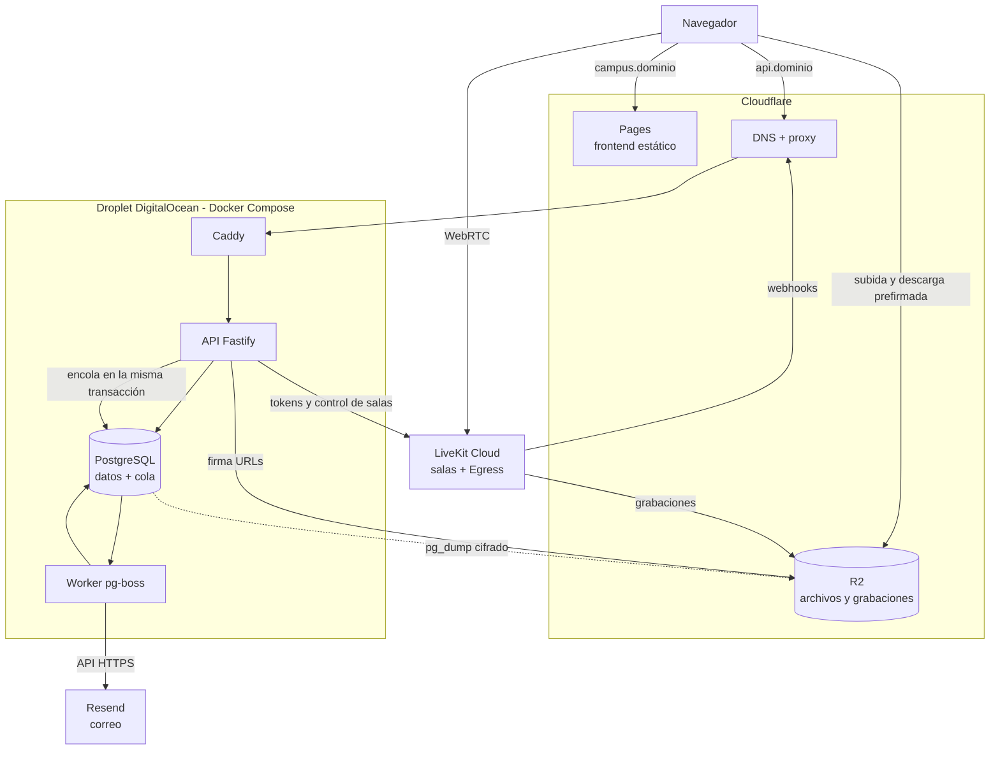
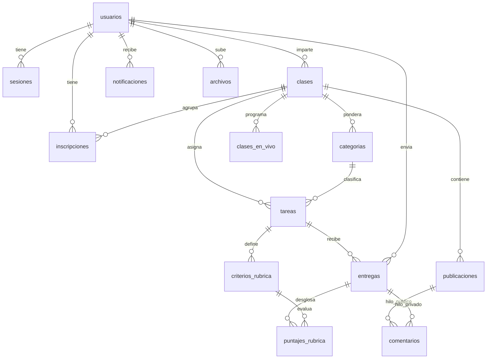

# ARCHITECTURE — CMEP Campus Digital

> Tecnología, stack, flujos y modelo de datos. El **qué** y el **para quién** están en `PRD.md`.
> Versión resumida para agentes: `ARCHITECTURE-ESSENTIALS.md`.
>
> **Versión 3 — fase experimental.** Sin AWS. Un servidor pequeño rentado, servicios de pago por uso para lo que varía, y todo reemplazable por configuración el día que el colegio tenga servidor propio. **Correo con Resend:** activo para cuentas (recuperar contraseña, alta de maestros); los avisos por correo están construidos pero apagados por defecto.

## 1. Principios

1. **Sin AWS y sin ataduras.** Ningún servicio de AWS. Todo proveedor externo debe poder sustituirse cambiando configuración, no código. Proveedores aprobados: **DigitalOcean** (servidor), **Cloudflare** (DNS, frontend y archivos), **LiveKit Cloud** (video) y **Resend** (correo). Cualquier otro requiere aprobación explícita.
2. **El núcleo es portátil.** API, worker y base de datos corren en Docker Compose: lo mismo en el Droplet y, mañana, en un servidor del colegio. En `dev` la API y el worker corren en el anfitrión con `npm run dev` / `npm run dev:worker`, y solo PostgreSQL, MinIO y LiveKit van en Compose.
3. **Piso fijo pequeño, pago por uso en lo que varía.** Un servidor mínimo de costo fijo; archivos, video y frontend solo cuestan si se usan.
4. **Monolito modular.** Una sola API con módulos por dominio.
5. **Autorización en el backend, en un solo lugar.**
6. **Lo lento va por cola.**
7. **Consultas con índice y paginadas.** Sin recorridos completos ni consultas dentro de ciclos.
8. **Portabilidad por adaptadores.** Ningún código de negocio importa una librería de infraestructura.
9. **Operar es parte del producto.** Respaldos, actualizaciones y monitoreo son obligatorios.
10. **Diseñado para 2,000 usuarios simultáneos, desplegado para uso experimental.** La arquitectura soporta el peor caso; el tamaño del servidor se ajusta al uso real.

## 2. Stack

| Capa | Tecnología | Dónde corre |
|---|---|---|
| Frontend | React + Vite + TypeScript (SPA) · Tailwind con tokens propios · shadcn/ui reestilizado · lucide-react · sonner · React Router · TanStack Query · FullCalendar · `@livekit/components-react` | **Cloudflare Pages** |
| DNS y protección | Cloudflare (proxy, DDoS, TLS en el borde) | Cloudflare |
| Proxy inverso y TLS de origen | Caddy | Droplet |
| API | Node.js LTS + Fastify + TypeScript · zod | Droplet |
| Worker | Misma imagen que la API, otro arranque | Droplet |
| Base de datos | PostgreSQL 17 con `pg_trgm` y `unaccent` · Prisma | Droplet |
| Cola y trabajos diferidos | pg-boss (sobre PostgreSQL) | Droplet |
| Autenticación | Propia: argon2id + JWT (`jose`) + token de refresco rotativo | Droplet |
| Archivos | Almacén compatible con S3, cliente `minio`: **Cloudflare R2** en producción, **MinIO** en desarrollo | Cloudflare / local |
| Clases en vivo | **LiveKit Cloud** + Egress hacia R2 · `livekit-server --dev` en desarrollo | LiveKit / local |
| Notificaciones | Dentro de la plataforma (canal principal) | Droplet |
| Correo | **Resend**, por API HTTPS, paquete `resend`. En desarrollo: canal `registro` (no envía nada) | Resend / local |
| Logs | pino (JSON) + rotación de Docker | Droplet |
| Monitoreo | Monitoreo y verificación de disponibilidad de DigitalOcean | DigitalOcean |
| Respaldos | `pg_dump` diario cifrado hacia un bucket de R2 + respaldos del Droplet | Cloudflare / DigitalOcean |
| Empaquetado | Docker + Docker Compose | — |
| Integración continua | GitHub Actions: lint, test, build y publicación de imágenes | GitHub |
| Pruebas | Vitest. Backend: unitarias e integración contra el PostgreSQL de `infra/` (nunca una base compartida ni `prod`); Testcontainers pendiente. Frontend: jsdom + Testing Library · Playwright (hito 3) | — |

No se usa ninguna librería de AWS: el cliente de archivos es el paquete `minio`, que habla el protocolo S3 con cualquier almacén compatible.

## 3. Vista general



## 4. Infraestructura

### Qué corre dónde
| Pieza | Proveedor | Modelo de costo |
|---|---|---|
| API, worker, PostgreSQL, Caddy | Droplet de DigitalOcean | Fijo y pequeño |
| Frontend | Cloudflare Pages | Gratuito |
| DNS, proxy y protección | Cloudflare | Gratuito |
| Archivos, grabaciones y respaldos | Cloudflare R2 | Por GB almacenado, sin costo de descarga |
| Video | LiveKit Cloud | Plan gratuito; de pago al haber uso real |
| Correo | Resend | Plan gratuito (3,000 al mes); de pago si se encienden los avisos masivos |

### Tamaño del Droplet
| Fase | Tamaño | Nota |
|---|---|---|
| Experimental | 2 vCPU · 2–4 GB RAM · Ubuntu LTS | Suficiente para uso esporádico |
| Uso institucional | 4 vCPU · 8 GB RAM | Se redimensiona con un reinicio; la arquitectura no cambia |

- Con poca memoria **no se compilan imágenes en el servidor**: GitHub Actions las construye y publica, y el Droplet solo las descarga.
- Un Droplet apagado se sigue cobrando. Para pausar el proyecto: instantánea → destruir → recrear después.

### Dominio (requisito a cargo del colegio)
Un dominio a nombre del colegio, con el DNS administrado en Cloudflare:
- `campus.<dominio>` → Cloudflare Pages (frontend)
- `api.<dominio>` → Droplet, a través del proxy de Cloudflare
- `archivos.<dominio>` → bucket público de R2 (imágenes del login)
- Registros **SPF, DKIM y DMARC** que indica Resend, para enviar como `notificaciones@<dominio>`. No hace falta que el colegio tenga buzones institucionales
- Opcional y gratuito: reenvío de correo de Cloudflare para que `contacto@<dominio>` llegue al Gmail del colegio, y sirva de dirección de respuesta

Frontend y API comparten dominio registrable, condición para que la cookie de sesión `SameSite=Strict` funcione.

### Contenedores
Producción (`infra/docker-compose.prod.yml`, pendiente de escribir): `caddy` · `api` · `worker` · `postgres`.
Desarrollo (`infra/docker-compose.yml`, proyecto `campus-dev`): `postgres` · `minio` · `minio-init` (efímero: crea los buckets y termina) · `livekit` (modo dev). La API y el worker no van en contenedor en `dev`: corren en el anfitrión con `npm run dev` y `npm run dev:worker` desde `backend/`; el frontend, con `npm run dev` desde `frontend/`.

### Entornos
| Entorno | Dónde | Notas |
|---|---|---|
| `dev` | Computadora del desarrollador | Todo local y sin cuentas externas. Solo datos ficticios. Los correos no se envían: el canal `registro` los escribe en el log y guarda el HTML en `backend/tmp/correos/` para revisarlos. Las grabaciones se prueban contra un proyecto de LiveKit Cloud de desarrollo |
| `prod` | Droplet + Cloudflare + LiveKit Cloud | Despliegue aprobado por un humano |

Configuración en variables de entorno: `.env` fuera del repositorio, `.env.example` versionado. En `dev` hay un `.env` por paquete, cada uno con su `.env.example`, donde se consultan los nombres y los valores de desarrollo:
- `infra/.env`: lo lee Docker Compose; credenciales y puertos de PostgreSQL, MinIO y LiveKit en local.
- `backend/.env`: lo cargan la API y el worker al arrancar y lo valida `config/env.ts`; el CLI de Prisma lo lee vía `prisma.config.ts`. Arranque de la API y conexión a la base. Debe apuntar a la base que levanta `infra/.env`: los dos archivos tienen que coincidir.
- `frontend/.env`: lo lee Vite; dirección de la API. Ninguna variable `VITE_*` puede llevar un secreto: todas terminan en el bundle público.

## 5. Estructura del repositorio

```
/
├── package.json            workspaces de npm: shared, backend, frontend
├── frontend/
│   ├── components.json     configuración del CLI de shadcn
│   └── src/
│       ├── app/            rutas, layouts y guardas por rol
│       ├── features/       un módulo por dominio: types, data, lib, hooks, components/, *-view.tsx
│       ├── components/     ui/ (shadcn reestilizado) y layout/
│       ├── lib/            utilidades compartidas por 2+ módulos
│       ├── services/       authService, apiClient, liveService
│       ├── styles/         index.css (entrada de Tailwind) y tokens.css (tokens de diseño)
│       └── test/           configuración de Vitest (jsdom)
├── backend/
│   ├── prisma.config.ts    configuración del CLI de Prisma: esquema, migraciones y DATABASE_URL
│   ├── prisma/             schema.prisma y migraciones
│   ├── test/               configuración de Vitest y pruebas de integración
│   └── src/
│       ├── config/         validación de las variables de entorno (zod) y opciones del logger
│       ├── core/           lógica pura, sin I/O ni librerías de infraestructura
│       ├── adapters/       db (con el cliente generado en db/generated/, no versionado), auth, storage, notifier, queue, scheduler, live
│       ├── middleware/     cadena de autorización
│       ├── handlers/       un plugin de Fastify por dominio
│       ├── workers/        consumidores de la cola
│       ├── app.ts          construcción de la app de Fastify (la usan server.ts y las pruebas)
│       ├── server.ts       arranque de la API
│       └── worker.ts       arranque del worker
├── shared/                 tipos y esquemas zod comunes
├── infra/                  docker-compose de desarrollo, livekit/ y postgres/init/; Caddyfile, Compose de prod y scripts de respaldo, pendientes
└── docs/                   PRD, arquitectura, operación y trabajo/<RF>/
```

### Regla de capas

```
handlers ──► middleware ──► core ──► (interfaces) ◄── adapters ──► librerías de infraestructura
```

- `core/` no importa nada de `adapters/` ni librerías de infraestructura. Recibe sus dependencias por parámetro.
- `adapters/` es el **único** lugar donde se importa `@prisma/client`, `@prisma/adapter-pg`, `pg`, el cliente generado por Prisma (`adapters/db/generated/`, no versionado; lo produce `prisma generate`), `pg-boss`, `minio`, `resend`, `argon2`, `jose` o `livekit-server-sdk`.
- `handlers/` son delgados: validar entrada → llamar a `core` → responder.

| Adaptador | Implementación | Responsabilidad |
|---|---|---|
| `db` | Prisma | Repositorios por entidad. Única puerta a PostgreSQL |
| `auth` | argon2 + jose | Hash de contraseñas, emisión y verificación de tokens |
| `storage` | minio (→ R2 o MinIO según configuración) | URLs prefirmadas, borrado, metadatos |
| `notifier` | Canales **in-app** (tabla `notificaciones`) y **correo** (`resend` en `prod`, `registro` en `dev` y pruebas) | Única puerta de salida de avisos y correos. Decide el canal según el tipo de aviso y la configuración; quien lo llama no sabe por dónde sale |
| `queue` | pg-boss | Encolar eventos |
| `scheduler` | pg-boss | Trabajos diferidos: crear, reprogramar, cancelar |
| `live` | livekit-server-sdk | Tokens, salas, grabaciones, verificación de webhooks |

## 6. Autenticación y autorización

### Autenticación propia
- **Contraseñas:** argon2id. Mínimo 10 caracteres. Nunca en logs.
- **Token de acceso:** JWT firmado (HS256, secreto de 256 bits), 15 minutos, solo `sub`. Vive en memoria del navegador, nunca en `localStorage`.
- **Token de refresco:** aleatorio de 256 bits, cookie `HttpOnly; Secure; SameSite=Strict; Path=/api/auth`. En la base, **solo su hash** (tabla `sesiones`). 30 días, **rotación en cada uso**; si llega un token ya rotado se revocan todas las sesiones del usuario.
- **Límite de intentos:** 5 por 15 minutos por IP + correo. Mismo mensaje para usuario inexistente y contraseña incorrecta.
- **Registro público:** solo estudiantes. El correo es el identificador de acceso y **no se verifica**, así que puede estar mal escrito: por eso existe el respaldo del Administrador.
- **Maestros:** los crea el Administrador; reciben por correo un enlace de un solo uso (72 horas) para establecer su contraseña.
- **Administrador:** cuenta única creada con `npm run seed:admin`. No existe endpoint que cree administradores.

### Recuperación de contraseña
**Camino principal, por correo:**
- `POST /auth/recuperar` responde siempre lo mismo, exista o no el correo, y tarda lo mismo.
- Si existe, se envía un enlace de **un solo uso**, vigencia de 30 minutos. En la base se guarda solo el hash del token (`tokens_cuenta`).
- Al usarlo se revocan todas las sesiones del usuario. Límite: 3 solicitudes por hora por correo e IP.

**Respaldo, por el Administrador** (correo mal escrito o inaccesible):
- "Restablecer contraseña" en Gestión de usuarios genera una **contraseña temporal aleatoria, mostrada una sola vez**; se guarda solo su hash.
- Activa `debe_cambiar_contrasena` y revoca las sesiones. Con esa bandera, tras iniciar sesión **el único endpoint permitido es el cambio de contraseña**.
- El Administrador también puede corregir el correo de un usuario.
- La contraseña del Administrador se restablece con `npm run reset:admin`, con acceso al servidor.

### Cadena de middleware (en este orden)

| # | Paso | Falla con |
|---|---|---|
| 1 | `authenticate`: verifica firma y vigencia del JWT → `userId` | 401 |
| 2 | `withProfile`: lee el usuario → `{ userId, rol, activo, accesoRestringido, debeCambiarContrasena }` | 401 |
| 3 | `withPasswordGate`: si `debeCambiarContrasena`, solo pasa `POST /auth/cambiar-contrasena` | 403 `CAMBIO_DE_CONTRASENA_REQUERIDO` |
| 4 | `withAccess`: si `accesoRestringido`, solo pasan `GET /me` y `GET /me/estado-pago` | 403 `ACCESO_RESTRINGIDO` |
| 5 | `requireRole(...)` | 403 |
| 6 | `requireMembership` / `requireOwnership` sobre `claseId` | 403 |
| 7 | Handler | |

- Rol, restricción y banderas **no viajan en el token**: se leen en cada petición, así cualquier cambio tiene efecto inmediato.
- La restricción también impide emitir tokens de LiveKit y URLs de archivos o grabaciones.
- El estado de pago de otro alumno solo se devuelve a admin, o al maestro dueño de una clase donde ese alumno está inscrito. Para estudiantes el campo **se omite**.

## 7. API

Fastify, un plugin por dominio, prefijo `/api`, servida en `api.<dominio>`. CORS con credenciales y origen exacto `https://campus.<dominio>`. `@fastify/helmet` y `@fastify/rate-limit`.

| Módulo | Rutas principales |
|---|---|
| `auth` | `POST /auth/registro` · `POST /auth/login` · `POST /auth/refrescar` · `POST /auth/logout` · `POST /auth/recuperar` · `POST /auth/restablecer` · `POST /auth/establecer-contrasena` (invitación de maestro) · `POST /auth/cambiar-contrasena` |
| `usuarios` | `GET /me` · `GET /me/estado-pago` · `GET /usuarios/buscar?q=` |
| `clases` | `POST /clases` · `GET /clases` · `GET/PUT /clases/{id}` · `POST /clases/unirse` · `GET/POST/DELETE /clases/{id}/alumnos` · `GET/POST /clases/{id}/publicaciones` · comentarios |
| `tareas` | `GET/POST /clases/{id}/tareas` · `GET/PUT/DELETE /tareas/{id}` · `PUT/DELETE /tareas/{id}/entrega` · `GET /tareas/{id}/entregas` · hilo privado |
| `calificaciones` | `PUT /tareas/{id}/entregas/{alumnoId}/calificacion` · `GET /clases/{id}/gradebook` · `GET /me/calificaciones` |
| `archivos` | `POST /archivos/subida` · `POST /archivos/descarga` (devuelven URL prefirmada) |
| `notificaciones` | `GET /notificaciones` · `PUT /notificaciones/{id}/leida` · `PUT /notificaciones/leidas` |
| `calendario` | `GET /calendario?desde=&hasta=` |
| `envivo` | `GET/POST /clases/{id}/envivo` · `POST /envivo/{id}/token` · `POST /envivo/{id}/grabacion` · `POST /webhooks/livekit` (sin JWT, firma verificada) |
| `publico` | `GET /publico/anuncios` (sin JWT, caché de 60 s) |
| `admin` | usuarios (alta, baja, `POST /admin/usuarios/{id}/restablecer-contrasena`), clases, `PUT /admin/alumnos/estado-pago` (por lote), `PUT /admin/alumnos/{id}/acceso`, anuncios, `GET/PUT /admin/configuracion/avisos-correo`, KPIs, analytics |
| — | `GET /salud` |

Formato de error único: `{ "error": { "codigo": "...", "mensaje": "..." } }`. Toda lista paginada, máximo 100 elementos.
Detrás del proxy de Cloudflare, la IP real del cliente se toma de la cabecera que Cloudflare agrega, y Caddy solo acepta tráfico de los rangos de Cloudflare.

## 8. Procesamiento asíncrono

La API guarda el dato y encola el evento **en la misma transacción** (pg-boss usa la misma base). El proceso `worker` consume la cola.

| Evento | Lo que hace el worker |
|---|---|
| `PUBLICACION_CREADA`, `MATERIAL_CREADO`, `TAREA_CREADA` | Aviso a cada alumno de la clase |
| `ENTREGA_REALIZADA` | Aviso al maestro |
| `CALIFICACION_PUBLICADA` | Aviso al alumno |
| `COMENTARIO_CREADO` | Aviso a la contraparte |
| `RECORDATORIO_24H` (diferido) | Aviso a quienes no han entregado |
| `CLASE_POR_COMENZAR` (diferido o inmediato) | Aviso a los alumnos de la clase |
| `CORREO_DE_CUENTA` | Recuperación de contraseña o invitación de maestro: siempre por correo, nunca in-app |
| `ENVIAR_CORREO` | Un envío individual a Resend. Los avisos con correo activado generan uno por destinatario |
| `GRABACION_LISTA` (desde webhook) | Registra el archivo en `clases_en_vivo` |
| `LIMPIEZA_DIARIA` (cron) | Borra notificaciones de más de 90 días, sesiones y tokens vencidos, archivos huérfanos |
| `RESPALDO_DIARIO` (cron) | `pg_dump` cifrado hacia R2 |

"Aviso" significa: notificación in-app **siempre**, y además correo **solo si** ese tipo de evento está activado en la configuración.

- El worker nunca escribe notificaciones ni llama a Resend directamente: usa `notifier.avisar(destinatarios, aviso)` y `notifier.correoDeCuenta(...)`.
- Los correos se envían de uno en uno, con límite de ritmo acorde al del proveedor. Un fallo de Resend reintenta ese correo, no todo el evento.
- Idempotencia: `eventId` como `singletonKey`; restricción única `(usuario_id, evento_id)` en `notificaciones`.
- 3 reintentos con espera exponencial; después, cola de fallidos vigilada.

## 9. Correo

**Proveedor: Resend**, por API HTTPS. No se usa SMTP: DigitalOcean bloquea esos puertos en sus Droplets, y la API no tiene esa limitación.

### Dos niveles
| Nivel | Correos | Estado |
|---|---|---|
| **1. De cuenta** | Recuperación de contraseña · invitación de maestro para establecer contraseña | **Siempre activos.** Volumen mínimo |
| **2. De aviso** | Nueva publicación, material o tarea · calificación publicada · recordatorio de 24 h · clase por comenzar | **Construidos y apagados por defecto.** El Administrador enciende cada tipo por separado en Configuración |

Se recomienda encender primero los dos sensibles al tiempo (clase por comenzar y recordatorio de 24 h) y observar el volumen antes de activar los demás.

### Reglas
- Remitente `notificaciones@<dominio>`; dirección de respuesta configurable. Plantillas HTML con la identidad del producto, más versión en texto plano.
- Requiere SPF, DKIM y DMARC en el dominio del colegio. Sin ellos, los correos caen en spam.
- La llave de Resend vive solo en el `.env` del servidor.
- Los interruptores viven en la tabla `configuracion`. `notifier` los consulta con caché de 60 s.
- En `dev` y en pruebas el canal es `registro`: **jamás sale un correo real fuera de `prod`**.
- Plan gratuito: 3,000 correos al mes. Si el nivel 2 lo rebasa, se pasa a un plan de pago o se apagan tipos de aviso; los correos de cuenta tienen prioridad en la cola.
- Un correo que Resend rechaza de forma permanente (dirección inexistente) no se reintenta y queda registrado.
- Cambiar de proveedor es escribir otro canal dentro de `adapters/notifier`.

## 10. Tareas programadas

Trabajos diferidos de pg-boss (`startAfter`).

| Trabajo | Momento | Se crea al |
|---|---|---|
| `RECORDATORIO_24H` | `fecha_limite − 24 h` | Crear la tarea |
| `CLASE_POR_COMENZAR` | `fecha_inicio − 15 min` | Programar la clase en vivo |

El identificador se guarda en `trabajo_id`. **Editar o borrar la fecha obliga a cancelar y recrear el trabajo, en la misma transacción.** Si el momento ya pasó, no se programa. Fechas `timestamptz` en UTC.

## 11. Archivos

1. El cliente pide `POST /archivos/subida` con nombre, tipo, tamaño y contexto.
2. La API valida permisos, tipo y tamaño, registra el archivo como `pendiente` y devuelve una URL prefirmada de 5 minutos.
3. El navegador sube **directo al almacén**. Los archivos nunca pasan por Node ni por el Droplet.
4. Al confirmar la entrega o publicación, el archivo pasa a `confirmado`. Los `pendiente` de más de 24 h los borra la limpieza diaria.
5. La descarga es simétrica: URL prefirmada tras verificar permisos.

| Bucket | Prefijos | Acceso |
|---|---|---|
| `campus-privado` | `materiales/{claseId}/` · `entregas/{tareaId}/{alumnoId}/` · `grabaciones/{claseId}/` | Solo por URL prefirmada |
| `campus-publico` | `anuncios/` | Lectura pública en `archivos.<dominio>` |
| `campus-respaldos` | `postgres/` | Solo el token de respaldos |

- El bucket privado lleva una política CORS que solo admite el origen `https://campus.<dominio>`.
- Tres tokens de R2 distintos y de mínimo privilegio: aplicación, Egress de LiveKit (solo escritura en `grabaciones/`) y respaldos.
- En `dev`, MinIO (`infra/docker-compose.yml`) crea solo `campus-privado` (sin acceso anónimo) y `campus-publico` (lectura anónima); `campus-respaldos` existe solo en `prod`, en R2. El almacén de desarrollo es reemplazable por cualquier otro compatible con S3 (riesgo 10 de la sección 19). Cambiar de almacén es cambiar `STORAGE_ENDPOINT`, `STORAGE_ACCESS_KEY` y `STORAGE_SECRET_KEY`.

## 12. Clases en vivo

- **LiveKit Cloud.** Un proyecto para `dev` y otro para `prod`. La API genera el token de acceso tras toda la cadena de middleware; las llaves viven solo en el `.env` del servidor.
- El maestro publica video, audio y pantalla; el alumno entra en **modo webinar** (cámara y micrófono apagados por defecto) y usa el chat.
- El chat viaja por canales de datos de LiveKit; no toca el backend.
- Grabación con Egress de LiveKit Cloud, que sube el archivo por protocolo S3 a `campus-privado/grabaciones/{claseId}/` en R2. El webhook `egress_ended` encola `GRABACION_LISTA`. *La compatibilidad Egress → R2 se valida en la primera prueba de grabación; la alternativa es cualquier otro almacén S3.*
- **Control de cupo** configurable según el plan: participantes y grabaciones simultáneas → `SALA_LLENA` / `SIN_CUPO_DE_GRABACION`.
- **Plan gratuito (Build):** 100 participantes simultáneos, 2 grabaciones simultáneas, 60 minutos de transcodificación y 5,000 minutos-participante al mes, con tope duro. Suficiente para la fase experimental. Verificar cuotas vigentes antes de un uso mayor.
- **Ruta de salida:** `adapters/live` usa el SDK estándar. Autoalojar LiveKit es cambiar `LIVEKIT_URL` y las llaves.

## 13. Notificaciones

**Canal principal de avisos**, siempre activo. Ícono con contador para Estudiante y Maestro.

- Sondeo cada 60 s y al volver a la pestaña. Sin WebSockets. Un aviso de "clase por comenzar" se genera 15 minutos antes, así que el retraso del sondeo es irrelevante.
- El contador es un `COUNT` sobre un índice parcial `(usuario_id) WHERE leida = false`.
- Cada notificación enlaza a su contenido. Retención de 90 días.
- Como los avisos por correo arrancan apagados, el dashboard del estudiante refuerza lo urgente: próximas entregas y clases en vivo del día aparecen siempre arriba.

## 14. Modelo de datos

PostgreSQL. Tablas y columnas en `snake_case` en español; `camelCase` en TypeScript mediante `@map`. Llaves primarias UUID. Todas las tablas llevan `creado_en` y, donde aplica, `actualizado_en`.



| Tabla | Columnas principales | Restricciones e índices |
|---|---|---|
| `usuarios` | `id`, `email`, `hash_contrasena`, `debe_cambiar_contrasena`, `nombre`, `nombre_busqueda`, `rol`, `activo`, `estado_pago`, `fecha_estado_pago`, `acceso_restringido`, `motivo_restriccion`, `fecha_restriccion` | `email` único (en minúsculas) · GIN trigrama sobre `nombre_busqueda` · índice `(rol)` · único parcial que garantiza **un solo** `rol = 'admin'` |
| `sesiones` | `id`, `usuario_id`, `hash_token`, `expira_en`, `revocada_en`, `reemplazada_por`, `ip`, `agente` | `hash_token` único · índice `(usuario_id)` |
| `tokens_cuenta` | `id`, `usuario_id`, `tipo` (`recuperacion` / `invitacion`), `hash_token`, `expira_en`, `usado_en` | `hash_token` único · índice `(usuario_id)` |
| `clases` | `id`, `maestro_id`, `nombre`, `descripcion`, `codigo_invitacion`, `activa` | `codigo_invitacion` único · índice `(maestro_id)` |
| `categorias` | `id`, `clase_id`, `nombre`, `peso` | `CHECK (peso BETWEEN 0 AND 100)`; la suma = 100 se valida en `core` |
| `inscripciones` | `clase_id`, `usuario_id`, `origen`, `creado_en` | PK compuesta · índice `(usuario_id)` |
| `publicaciones` | `id`, `clase_id`, `autor_id`, `tipo`, `texto` | índice `(clase_id, creado_en DESC)` |
| `tareas` | `id`, `clase_id`, `categoria_id`, `titulo`, `instrucciones`, `fecha_limite`, `puntos`, `trabajo_id` | índice `(clase_id, fecha_limite)` |
| `criterios_rubrica` | `id`, `tarea_id`, `criterio`, `puntos_max`, `orden` | índice `(tarea_id)` |
| `entregas` | `id`, `tarea_id`, `alumno_id`, `estado`, `fecha_entrega`, `con_retraso`, `enlaces` (jsonb), `calificacion`, `fecha_calificacion` | único `(tarea_id, alumno_id)` · índice `(alumno_id)` |
| `puntajes_rubrica` | `entrega_id`, `criterio_id`, `puntos` | PK compuesta |
| `archivos` | `id`, `clave_objeto`, `nombre`, `tipo`, `tamano`, `subido_por`, `estado`, `publicacion_id`, `tarea_id`, `entrega_id` | `clave_objeto` único · exactamente un contexto no nulo |
| `comentarios` | `id`, `publicacion_id`, `entrega_id`, `autor_id`, `texto` | exactamente uno de los dos contextos · índices por contexto y fecha |
| `notificaciones` | `id`, `usuario_id`, `evento_id`, `tipo`, `mensaje`, `enlace`, `leida` | único `(usuario_id, evento_id)` · índice `(usuario_id, creado_en DESC)` · parcial `WHERE leida = false` |
| `clases_en_vivo` | `id`, `clase_id`, `titulo`, `fecha_inicio`, `estado`, `sala`, `grabando`, `egress_id`, `clave_grabacion`, `trabajo_id` | índices `(clase_id, fecha_inicio)` y `(estado)` |
| `anuncios_login` | `id`, `titulo`, `texto`, `archivo_id`, `orden`, `activo` | índice `(activo, orden)` |
| `configuracion` | `clave`, `valor` (jsonb), `actualizado_por` | PK `clave`. Guarda, entre otros, los interruptores de avisos por correo |

`estado` de entrega: `asignado` · `entregado` · `calificado`. "Sin entregar" se deriva de `asignado` con fecha vencida.
Las tablas de pg-boss viven en su propio esquema (`pgboss`) y no se tocan a mano.

### Reglas de acceso a datos
- **Prisma solo dentro de `adapters/db`.**
- **Sin consultas N+1:** nunca una consulta dentro de un ciclo.
- **Toda consulta filtra por una columna indexada y toda lista se pagina.** Una consulta que no encaje en un índice existente exige proponer el índice en el plan.
- **SQL crudo solo con parámetros.** Nunca se concatena entrada del usuario.
- **Escrituras compuestas en transacción**, incluido el encolado del evento.
- **Promedios, gradebook, alumnos en riesgo y KPIs se calculan con consultas agregadas**, no se guardan.
- Búsqueda de alumnos con `unaccent` + trigramas sobre `nombre_busqueda`. Frontend: 3 caracteres mínimo y espera de 300 ms.
- Todo cambio de esquema es una migración de Prisma versionada y compatible hacia atrás.

## 15. Capacidad

Supuesto de diseño: 2,000 usuarios simultáneos, ~450 req/s. **El Droplet experimental no está dimensionado para eso, ni hace falta:** la arquitectura sí lo está, y el servidor se redimensiona cuando el uso lo pida.

| Componente | Peor caso | Con el Droplet de 4 vCPU / 8 GB | Estado |
|---|---|---|---|
| Cloudflare (Pages, proxy) | Todo el tráfico del frontend | Sin límite práctico | Sobrado |
| API Fastify | ~450 req/s | Varios miles de req/s en consultas simples | Holgado |
| PostgreSQL | ~1,500 consultas/s, casi todas lecturas por índice | Holgado con un pool de 20–30 conexiones | Bien |
| Login (argon2id) | ~35 logins/s en ráfaga | Costoso a propósito: ~50–100 ms de CPU cada uno | Vigilar; el límite de intentos protege |
| Worker | Ráfagas de cientos de notificaciones y, si se activan, de correos | Inserciones por lote; correos limitados por el ritmo del proveedor | Sobrado; los correos masivos pueden tardar minutos |
| R2 | Cientos de subidas cerca de una fecha límite | No pasa por nuestro servidor | Sobrado |
| LiveKit Cloud | Varias clases simultáneas | Limitado por las **cuotas del plan** | **Cuello de botella: depende de presupuesto** |

Escalado, en este orden y solo si las métricas lo piden: redimensionar el Droplet → PostgreSQL a su propia máquina o servicio gestionado → segunda instancia de la API (no guarda estado).

## 16. Seguridad

**Aplicación**
- Validación de toda entrada con zod en el borde del handler.
- `@fastify/helmet`, CORS de origen exacto con credenciales, límite de peticiones global y más estricto en `/auth/*`.
- Cookies `HttpOnly`, `Secure`, `SameSite=Strict`; el token de acceso solo en memoria.
- URLs prefirmadas de 5 minutos con tipo y tamaño fijados. Buckets privados salvo `campus-publico`.
- Los enlaces de recuperación e invitación son de un solo uso, caducan y se guardan solo como hash. Las respuestas de `/auth/recuperar` no revelan si un correo existe.
- Las contraseñas temporales se muestran una sola vez, se guardan solo como hash y obligan al cambio inmediato.
- El webhook de LiveKit verifica la firma.
- Secretos solo en `.env` del servidor (permisos `600`) y en los secretos del repositorio para CI.
- Logs sin contraseñas, tokens ni datos de pago.

**Servidor**
- SSH solo con llave; sin contraseña y sin `root` directo.
- Cortafuegos de DigitalOcean y `ufw`: 80 y 443 **solo desde los rangos de Cloudflare**, y SSH.
- PostgreSQL nunca expuesto a internet: solo red interna de Docker.
- `fail2ban` y actualizaciones de seguridad automáticas.
- Imágenes de contenedor con versión fijada y revisión mensual.

## 17. Operación

| Tema | Mínimo aceptable |
|---|---|
| **Respaldos** | `pg_dump` diario, cifrado, hacia `campus-respaldos` en R2 (otro proveedor que el del servidor). Retención: 7 diarios, 4 semanales, 6 mensuales. Además, respaldos semanales del Droplet |
| **Prueba de restauración** | Una restauración completa en otra máquina antes de abrir a alumnos, y después cada trimestre |
| **Archivos** | R2 replica internamente. En esta fase no se respaldan aparte; riesgo aceptado y documentado |
| **Monitoreo** | Verificación de disponibilidad sobre `/salud` y alertas de CPU, memoria y disco al 80 %, con aviso al responsable. Alerta de gasto en DigitalOcean y en Cloudflare |
| **Logs** | pino en JSON con `requestId` y `userId`; rotación de Docker (50 MB × 5). Retención de 14 días |
| **Actualizaciones** | Parches del sistema automáticos; PostgreSQL y dependencias, revisión mensual |
| **Documentación** | `docs/OPERACION.md`: cuentas y a nombre de quién, accesos, secretos, cómo desplegar, cómo restaurar, cómo revocar un acceso, cómo restablecer la contraseña del administrador |

## 18. Despliegue

**Frontend:** Cloudflare Pages despliega solo en cada push a la rama principal; cada rama obtiene su URL de vista previa.

**Backend:**
1. GitHub Actions ejecuta `lint`, `test` y `build` en cada *pull request*.
2. Al fusionar, construye la imagen y la publica en el registro de contenedores de GitHub.
3. En el Droplet, con aprobación humana: `docker compose pull` → `npx prisma migrate deploy` → `docker compose up -d`.
   Pendiente para el encargo de despliegue, con Prisma 7: `migrate deploy` necesita, en la imagen o en un contenedor de migración aparte, `backend/prisma.config.ts`, `backend/prisma/schema.prisma`, `backend/prisma/migrations/` y el CLI `prisma` (hoy devDependency); `DATABASE_URL` llega del entorno (`prisma.config.ts` solo carga `.env` si existe). `prisma generate` en la etapa de build también exige una `DATABASE_URL`, aunque no se conecte, porque `env()` de `prisma/config` se evalúa al cargar el archivo: basta un valor de relleno sin secreto. Y `package-lock.json` no marca el CLI como `dev`: `node_modules/prisma` figura como `peer` (además de `devOptional`) por el par opcional `prisma *` que declara `@prisma/client`, y sus dependencias (`mysql2`, `postgres`, `@prisma/dev`, `@prisma/studio-core`) solo como `devOptional`; el encargo de despliegue debe comprobar con un `npm ci` real qué instala `--omit=dev` en la imagen y cómo aislar el CLI (imagen de build o contenedor de migración aparte).
4. Verificación: `/salud` y una prueba de humo del login.
5. Reversión: etiqueta anterior de la imagen. **Las migraciones se escriben compatibles hacia atrás** (agregar antes de quitar), porque el frontend y el backend se despliegan por separado y pueden convivir versiones distintas unos minutos.

### Migración a un servidor propio
1. Instalar Docker en el servidor del colegio y clonar el repositorio.
2. Restaurar el último respaldo de PostgreSQL.
3. Copiar el `.env`.
4. Apuntar `api.<dominio>` a la nueva IP en Cloudflare.
5. Archivos: se quedan en R2, o se sincronizan a un MinIO local y se cambian tres variables.
6. Frontend: se queda en Pages, o lo sirve Caddy desde el mismo servidor.

## 19. Riesgos técnicos

1. **Correos no verificados.** Un alumno que escribió mal su correo no recibirá el enlace de recuperación; para eso existe el respaldo del Administrador. Con los avisos por correo apagados, un aviso solo se ve si el usuario entra a la plataforma.
1b. **Entregabilidad:** depende de que SPF, DKIM y DMARC estén bien configurados en el dominio del colegio.
2. **Operación propia del Droplet:** respaldos, disco y parches.
3. **Clases en vivo:** cuotas del plan, redes de usuarios que bloqueen WebRTC, permisos de cámara y la subida de grabaciones de Egress a R2.
4. **Autenticación propia:** más superficie de error que un servicio administrado. Mitigación: diseño de la sección 6 sin atajos y pruebas adversarias en cada cambio.
5. **Un solo servidor = un solo punto de falla.** Aceptable con respaldos probados.
6. **Frontend y backend desplegados por separado:** versiones desalineadas por minutos. Mitigación: cambios de API compatibles hacia atrás.
7. **Autorización:** un endpoint que olvide el middleware filtra datos.
8. **Cálculo de calificaciones:** casos borde.
9. **Trabajos diferidos desincronizados** al editar fechas.
10. **Distribución de MinIO en desarrollo.** MinIO comunitario dejó de distribuirse por Docker Hub: `minio/minio` y `minio/mc` niegan la descarga incluso de etiquetas existentes. En `dev` se usan `quay.io/minio/minio:RELEASE.2025-09-07T16-13-09Z` y `quay.io/minio/mc:RELEASE.2025-08-13T08-35-41Z`, imágenes sin mantenimiento; `quay.io` es solo el registro de descarga de una herramienta local, no un proveedor del proyecto. Mitigación: el almacén de desarrollo es reemplazable por cualquier otro compatible con S3 cambiando `STORAGE_ENDPOINT`, `STORAGE_ACCESS_KEY` y `STORAGE_SECRET_KEY`; `prod` usa R2 y no depende de estas imágenes.

## 20. Registro de decisiones

| # | Decisión | Alternativa descartada | Motivo |
|---|---|---|---|
| D-01 | **Sin AWS; proveedores aprobados y reemplazables por configuración** | Arquitectura serverless en AWS (v1) · todo autoalojado (v2) | Decisión del proyecto; fase experimental con costo mínimo y migración fácil |
| D-02 | Autenticación propia (argon2id + JWT + refresco rotativo) | Keycloak · servicios de identidad | Un método de acceso y tres roles no justifican más |
| D-03 | Sin verificación de correo al registrarse | Código por correo | Decisión de producto |
| D-04 | Maestros dados de alta por el admin | Registro público | Sin verificación, el registro abierto de maestros es un riesgo |
| D-05 | PostgreSQL + Prisma | MySQL · MongoDB | Datos muy relacionales; agregados y búsqueda resueltos en la base |
| D-06 | Monolito modular con Fastify | Microservicios · NestJS · Express | Una sola unidad que desplegar y depurar |
| D-07 | pg-boss | Redis + BullMQ | La cola vive en PostgreSQL: transaccional y un servicio menos |
| D-08 | **Correo con Resend por API HTTPS.** Correos de cuenta siempre activos; avisos por correo construidos y apagados por defecto | SNS · SMTP del colegio · sin correo | El colegio solo usa Gmail y DigitalOcean bloquea SMTP; una API con dominio propio resuelve ambas cosas. Sin correo, recuperar contraseñas y dar de alta maestros dependía por completo del Administrador |
| D-09 | Archivos en Cloudflare R2 con URLs prefirmadas; MinIO en desarrollo | MinIO en el servidor · Spaces | Pago por GB, descargas sin costo, nada que operar; mismo protocolo que MinIO |
| D-10 | LiveKit Cloud | LiveKit autoalojado | Evita operar un servidor de video; la migración es de configuración |
| D-11 | Caddy | Nginx + certbot | Configuración mínima |
| D-12 | Docker Compose | Kubernetes · plataformas gestionadas | Idéntico en local, en el Droplet y en un servidor propio |
| D-13 | React + Vite (SPA) | Next.js | Sin SEO ni SSR que justificar |
| D-14 | Sondeo de notificaciones | WebSockets · SSE | Simplicidad |
| D-15 | Rol, restricción y banderas leídos por petición | Datos en el token | Efecto inmediato |
| D-16 | Agregados por consulta | Contadores precalculados | SQL los resuelve |
| D-17 | Capas `core` / `adapters` / `handlers` | Librerías en cualquier parte | Portabilidad y capacidad de prueba |
| D-18 | shadcn/ui reestilizado | Componentes a mano · shadcn por defecto | Accesibilidad sin aspecto genérico |
| D-19 | Solo modo claro en el piloto | Claro y oscuro | Mitad de trabajo de diseño |
| D-20 | Droplet pequeño de DigitalOcean, redimensionable | Equipo en el colegio · Vultr · Hetzner · Railway | Costo fijo bajo, documentación, y es un servidor Linux estándar: migrar es restaurar un respaldo |
| D-21 | Frontend en Cloudflare Pages y DNS en Cloudflare | Servido por Caddy · Vercel | Gratuito, despliegue automático con vistas previas, protección delante del servidor |
| D-22 | Restablecimiento por el Administrador con contraseña temporal de un solo uso, como **respaldo** | Único camino · no tenerlo | Los correos no se verifican al registrarse, así que habrá direcciones mal escritas |
| D-23 | Imágenes de MinIO para `dev` desde `quay.io`, con etiqueta fija; `quay.io` no cuenta como proveedor del proyecto | MinIO desde Docker Hub (ya no disponible) · otro almacén S3 local | Docker Hub niega la descarga de `minio/minio` y `minio/mc`; es solo el registro de una herramienta local y el almacén de `dev` sigue siendo reemplazable por configuración. Decisión escrita del humano en INFRA-01 |
| D-24 | Prisma 7 con generador `prisma-client`, `@prisma/adapter-pg` y `pg`; cliente generado en `adapters/db/generated/`, no versionado | Prisma 6 con `prisma-client-js` y motor de consultas nativo | Última línea estable; sin motor nativo en la API ni en el worker, el adaptador habla con PostgreSQL a través de `pg`. Decidido en BACK-01 y aplicado en BACK-02 |
