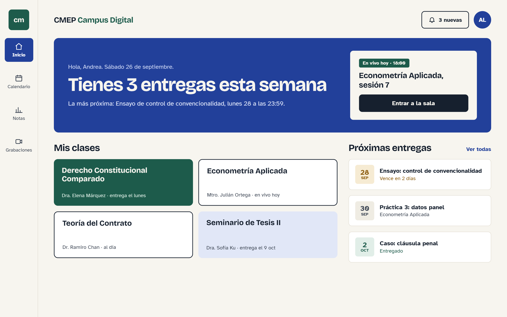

# DESIGN — Sistema visual de CMEP Campus Digital

> **Fuente única del sistema visual:** principios, tokens con valor y uso, tipografía, forma y espacio, foco y contraste, patrones, densidad por rol y tono de los textos.
> Las reglas técnicas (cómo se consumen los tokens en el código, qué componentes existen) están en `CLAUDE.md`, "Sistema de diseño". Lo que se lee y cuándo, en `AGENTS.md`.
> **Todo patrón visual nuevo que cree un encargo se documenta aquí en ese mismo encargo, y el manager lo verifica.**

| Campo | Valor |
|---|---|
| Dirección | **C**, elegida por el humano. Referencia: `docs/design/referencia-direccion-c.png` |
| Registrado | 2026-09-26 |
| Estado de aplicación | `frontend/src/styles/tokens.css` todavía tiene los valores provisionales de FRONT-01. El encargo de dirección visual aplica los de este documento |
| Marcas | **captura**: medido en la referencia. **propuesta**: no aparece en la captura; lo confirma o corrige el encargo de dirección visual |

## 1. Referencia

La captura muestra el dashboard del estudiante en una ventana de 1280 × 800 px (la imagen, de 2560 × 1600, está a densidad 2x). Los colores se midieron pixel a pixel. Los tamaños y las distancias se midieron sobre la imagen y se redondearon a la escala de 4 px, con un margen de ±1 px en los tamaños de letra.

Los textos de la captura son ilustrativos: mandan los del PRD. Por ejemplo, la barra lateral dice "Calificaciones", no "Notas".

## 2. Principios

1. **Lo siguiente, primero.** Cada vista abre con lo que la persona tiene que hacer después, dicho con dato, fecha y hora: "Tienes 3 entregas esta semana". Hay un solo bloque destacado y una sola acción principal por vista.
2. **Papel, tinta y dos colores con oficio.** Fondo crema cálido y tinta azul noche para el texto y el contorno fuerte. El azul es la acción principal, el énfasis y la navegación; el verde, la marca y lo logrado. No hay grises neutros.
3. **Plano, con bordes.** La página no usa sombras: las superficies se separan por color o por borde. Solo lo que flota lleva sombra: menús, diálogos y avisos.
4. **La tipografía jerarquiza.** Títulos pesados con interletraje cerrado. El tamaño y el peso ordenan la página, no el color.
5. **El estado se dice con palabras.** "Vence en 2 días", "Entregado", "3 nuevas". El color refuerza el mensaje, nunca lo sustituye.
6. **Calma según el rol.** El estudiante tiene aire; la densidad aparece solo donde se trabaja con tablas (§8).

Referencias de carácter: Notion (editorial y cálido), Arc Browser (personalidad propia), Linear (orden y jerarquía). Google Classroom es referencia solo de arquitectura de información, nunca de estilo.

## 3. Color

### Tokens

**Base**

| Token | Valor | Uso | Origen |
|---|---|---|---|
| `--background` | `#F7F5EF` | Fondo de la aplicación y de la barra lateral. Tarjeta interna del bloque destacado | captura |
| `--surface` | `#FFFFFF` | Tarjetas, filas de lista, tablas, campos y capas flotantes | captura |
| `--foreground` | `#16202E` | Texto principal y títulos. Tinta del contorno fuerte (`--input`) y del botón sobre el bloque destacado (§7.3) | captura |
| `--muted` | `#EFECE3` | Fondos sutiles: cuadro de fecha neutro, encabezado de tabla, fila bajo el cursor | captura |
| `--muted-foreground` | `#3D4654` | Texto secundario, metadatos, etiquetas de la barra lateral | captura |
| `--border` | `#DDD8CB` | Bordes que separan: filas de entrega, tablas, divisores, borde de la barra lateral. **No delimita controles** (§6) | captura |
| `--input` | `#16202E` (apunta a `--foreground`) | Contorno fuerte de 2 px: campos, selects, casillas, botón `outline` y tarjeta de clase blanca | captura (botón de avisos) |

**Acción, énfasis y marca**

| Token | Valor | Uso | Origen |
|---|---|---|---|
| `--primary` / `--primary-foreground` | `#22409A` / `#FFFFFF` | Botón de la acción principal de la vista. Una por vista. Sobre el bloque destacado cambia a tinta (§7.3) | captura (azul); decisión del humano |
| `--accent` / `--accent-foreground` | `#22409A` / `#F7F5EF` | Bloque destacado, elemento activo de la barra lateral, enlaces ("Ver todas") y avatar | captura |
| `--accent-soft` | `#E1E7F7` | Texto secundario sobre `--accent`, tarjeta de clase lavanda, fila seleccionada | captura |
| `--brand` / `--brand-foreground` | `#1D5B4B` / `#F7F5EF` | Monograma, "Campus Digital" en el encabezado, tarjeta de clase verde, insignia "En vivo" | captura |
| `--brand-soft` | `#E1EEE8` | Texto secundario sobre `--brand` | captura |
| `--ring` | `#22409A` (apunta a `--accent`) | Anillo de foco (§6) | captura |

**Estados**

| Token | Valor | Uso | Origen |
|---|---|---|---|
| `--success` / `--success-soft` | `#1D5B4B` / `#E1EEE8` | "Al corriente", entregado, calificado | captura |
| `--warning` / `--warning-soft` | `#8A5A0B` / `#F6EBD3` | Con retraso, fecha límite próxima, alumno en riesgo | captura |
| `--danger` / `--danger-soft` | `#A3341F` / `#F7E4DE` | "Deudor", sin entregar, acceso restringido | decidido (razón en "Contraste verificado") |
| `--destructive` / `--destructive-foreground` | `#A3341F` / `#FFFFFF` | Errores y acciones destructivas (borrar, dar de baja, restringir) | decidido (razón en "Contraste verificado") |

- `--primary` y `--accent` comparten valor, pero no uso. `--primary` es solo el botón de la acción principal; `--accent`, el énfasis, la navegación y los enlaces.
- Los botones rellenos (`primary` y `destructive`) llevan texto blanco `#FFFFFF`.
- `--brand` y `--success` comparten valor, pero no significado: la marca y la identidad de una clase no comunican estado.
- Los derivados que shadcn espera (`--card`, `--popover`, `--secondary`, `--input`, `--ring`…) apuntan a un token de esta tabla, nunca a un valor propio.
- Tokens nuevos respecto de `tokens.css`, aceptados por el humano: `--accent-soft`, `--brand`, `--brand-foreground`, `--brand-soft`, `--success-soft`, `--warning-soft` y `--danger-soft`. `--input` deja de apuntar a `--border` y apunta a `--foreground`.

### Contraste verificado

Razones de contraste WCAG 2.2 calculadas con los valores de arriba. Todo par nuevo se verifica y se agrega aquí.

| Texto / fondo | Contraste |
|---|---|
| `--foreground` / `--background` · `--surface` · `--muted` · `--accent-soft` | 15.1 · 16.4 · 13.9 · 13.3 |
| `--muted-foreground` / `--background` · `--surface` · `--muted` · `--accent-soft` | 8.8 · 9.5 · 8.1 · 7.7 |
| `--primary-foreground` / `--primary` | 9.3 |
| `--background` / `--foreground` (botón sobre el bloque destacado) | 15.1 |
| `--accent-foreground` / `--accent` | 8.5 |
| `--accent-soft` / `--accent` (texto secundario del bloque destacado) | 7.5 |
| `--accent` / `--background` · `--surface` (enlaces) | 8.5 · 9.3 |
| `--brand-foreground` / `--brand` | 7.3 |
| `--brand-soft` / `--brand` | 6.6 |
| `--success` / `--surface` · `--success-soft` | 7.9 · 6.6 |
| `--warning` / `--surface` · `--background` · `--warning-soft` | 5.9 · 5.4 · 5.0 |
| `--danger` / `--surface` · `--background` · `--danger-soft` | 6.8 · 6.3 · 5.6 |
| `--destructive-foreground` / `--destructive` | 6.8 |

Todos superan el 4.5:1 que WCAG pide para texto normal. `--border` da 1.4:1 contra `--surface` y 1.3:1 contra `--background`: basta para separar superficies, pero no para delimitar un control, que necesita 3:1. Por eso los controles usan `--input`.

**Rojo de `--danger` y `--destructive`.** Entre `#A33A2B` y `#A3341F` se eligió `#A3341F` porque da más contraste en todos los pares:

| Par | `#A33A2B` | `#A3341F` |
|---|---|---|
| Sobre `--danger-soft` (el más justo) | 5.4 | 5.6 |
| Sobre `--surface` | 6.6 | 6.8 |
| Sobre `--background` | 6.0 | 6.3 |
| Texto blanco sobre el rojo | 6.6 | 6.8 |

`--danger` y `--warning` tienen una luminosidad casi igual (1.2:1 entre sí): se distinguen por tono y, sobre todo, por su texto. Por eso el estado nunca va solo en color.

## 4. Tipografía

### Familias

Decididas por el humano el 2026-09-26.

| Rol | Token | Familia | Pesos | Paquete |
|---|---|---|---|---|
| Títulos | `--font-heading` | Bricolage Grotesque | 500 y 700 | `@fontsource/bricolage-grotesque` |
| Texto | `--font-sans` | Atkinson Hyperlegible Next | 400, 500 y 700 | `@fontsource/atkinson-hyperlegible-next` |
| Códigos de clase | `--font-mono` | Atkinson Hyperlegible Mono | 500 | `@fontsource/atkinson-hyperlegible-mono` |

- **Bricolage Grotesque** es la tipografía de la dirección C.
- **Atkinson Hyperlegible Next**, del Braille Institute, está diseñada para distinguir letras y cifras parecidas (I, l y 1; O y 0).
- **Atkinson Hyperlegible Mono** es de la misma familia: en un código de clase, confundir la O con el 0 es un error real.

**Paquetes verificados en npm el 2026-09-26:** los tres existen, en la versión 5.3.0 y con licencia OFL-1.1. Cada uno trae los pesos del 200 al 800 en WOFF2, con el subconjunto latino, que incluye á, é, ñ, ¿ y ¡. También existe la versión variable de cada uno (`@fontsource-variable/…`): un solo archivo con todos los pesos.

**Reglas de carga:**
- Todas se autoalojan con Fontsource y se sirven desde el propio frontend. Nunca se cargan del CDN de Google Fonts, que no es proveedor aprobado.
- Instalar los paquetes es una dependencia nueva: la aprueba el humano en el encargo de dirección visual.
- Se cargan solo los pesos de esta tabla.

Nadie las ha visto en pantalla todavía, porque ningún agente abre navegadores. El encargo de dirección visual comprueba:

1. Cifras tabulares (`tnum`) en Atkinson Hyperlegible Next.
2. Lectura cómoda a 16 px y a 360 px de ancho.
3. Que el humano confirme en su navegador el parecido con la captura.

Si algo no cumple, se escala al humano.

### Escala

En `@theme`, cada tamaño es un token `--text-*` con sus variantes `--line-height`, `--font-weight` y `--letter-spacing`.

| Token | Tamaño / interlineado | Peso | Interletraje | Familia | Uso |
|---|---|---|---|---|---|
| `--text-display` | 44 px / 1.05 | 700 | −0.03em | títulos | Titular del bloque destacado; uno por vista. A menos de 640 px baja a 32 px |
| `--text-h1` | 28 px / 1.15 | 700 | −0.02em | títulos | Título de página (propuesta) |
| `--text-h2` | 22 px / 1.2 | 700 | −0.015em | títulos | Título de sección ("Mis clases") y día del cuadro de fecha |
| `--text-h3` | 18 px / 1.3 | 500 | −0.01em | títulos | Título de tarjeta. El nombre del producto en el encabezado usa este tamaño en 700 |
| `--text-body` | 16 px / 1.5 | 400 | 0 | texto | Texto corrido y campos. Título de fila de entrega, en 700 |
| `--text-small` | 14 px / 1.45 | 400 o 500 | 0 | texto | Metadatos, texto secundario y celdas de tabla. Botones, en 700 |
| `--text-caption` | 12 px / 1.35 | 500 o 700 | 0; +0.04em en mayúsculas | texto | Etiquetas de la barra lateral, insignias, mes del cuadro de fecha |

- La familia de títulos solo se usa en 500 y 700. En la captura, los títulos de tarjeta se ven más ligeros que los de sección; por eso `--text-h3` va en 500.
- Ningún texto mide menos de 12 px. En la captura, los metadatos miden cerca de 13 px; aquí suben a 14 px para facilitar la lectura.
- Cifras tabulares (`tabular-nums`) en tablas, calificaciones, gradebook, cuadros de fecha y horas.
- Mayúsculas solo en etiquetas de una o dos palabras, como el mes del cuadro de fecha.
- El texto corrido no pasa de unos 70 caracteres por línea (`max-width: 65ch`).

## 5. Forma y espacio

### Radios

Base `--radius: 0.5rem` (8 px); los demás radios se derivan de ella en `tokens.css`.

| Clase | Valor | Uso |
|---|---|---|
| `rounded-sm` | 4 px | Insignias y etiquetas de estado |
| `rounded-md` | 6 px | Cuadro de fecha y casillas |
| `rounded-lg` | 8 px | Botones, campos, tarjetas, filas, elementos de la barra lateral, monograma y capas flotantes |
| `rounded-xl` | 12 px | Bloque destacado |
| `rounded-full` | — | Avatar |

### Bordes

- **1 px `--border`:** filas de entrega, tablas, divisores y borde derecho de la barra lateral.
- **2 px `--input` (contorno fuerte, tinta):** campos, selects, casillas, botón `outline` y tarjeta de clase blanca.

### Sombras

La página no usa sombras. Las capas flotantes (menú, popover, select abierto, diálogo y aviso de sonner) usan `--shadow-overlay: 0 8px 24px rgb(22 32 46 / 0.12)`, tinta al 12 % (propuesta). Toda clase `shadow-*` por defecto de Tailwind o de shadcn se sustituye por este token o se elimina.

### Espaciado

La escala es la de Tailwind, múltiplos de 4 px (`--spacing: 0.25rem`). Medidas de la captura en escritorio:

| Elemento | Medida |
|---|---|
| Barra lateral | 96 px de ancho |
| Márgenes laterales del contenido | 40 px (16 px por debajo de 640 px) |
| Encabezado | 96 px de alto |
| Relleno del bloque destacado | 32 px arriba y abajo; 36 px a los lados |
| Separación entre bloques | 24 px |
| Del título de sección a su contenido | 20 px |
| Columnas del dashboard | proporción 2:1 (clases y entregas), con 28 px entre ellas |
| Separación entre tarjetas o filas | 16 px |
| Relleno de tarjeta de clase | 20 px |
| Relleno de fila de entrega | 16 px |

## 6. Foco, contraste y accesibilidad

- **Foco visible** en todo elemento interactivo, solo con `:focus-visible`: contorno sólido de 2 px en `--ring`, separado 2 px del elemento. Si el elemento está sobre una superficie `--accent` o `--brand` (dentro del bloque destacado o de una tarjeta de clase verde), el contorno es `--background`. Nunca se quita el contorno sin poner otro en su lugar.
- **Contraste mínimo:** 4.5:1 en texto normal; 3:1 en texto grande (24 px o más, o 18.66 px en 700), en bordes de controles y en el indicador de foco. Los pares verificados están en §3.
- **Controles** con borde `--input`. `--border` no basta (§3).
- **Tamaño de los objetivos:** 44 × 44 px en las vistas de estudiante y maestro; 36 px de alto en las tablas del administrador. WCAG 2.2 pide al menos 24 px.
- **Estado** siempre con texto o icono, además del color.
- **Movimiento:** transiciones de 150 ms o menos, solo en color y fondo, y ninguna animación decorativa. Con `prefers-reduced-motion: reduce`, el indicador de carga deja de girar y queda su texto.
- **Botones con una petición en vuelo:** hoy pierden el foco al deshabilitarse (AUTH-02b, MF-05 y T-14, en `docs/ESTADO.md`). El encargo de dirección visual fija el patrón y lo documenta en esta sección.

## 7. Patrones

### 7.1 Controles

| Variante | Aspecto | Cuándo |
|---|---|---|
| `primary` | Fondo `--primary` (azul), texto `--primary-foreground` (blanco) en 700 | La acción principal; una por vista |
| `primary` sobre el bloque destacado | Fondo `--foreground` (tinta), texto `--background` en 700 | La acción principal cuando vive dentro del bloque destacado (§7.3) |
| `outline` (por defecto) | Fondo `--surface`, borde 2 px `--input`, texto `--foreground` | Todo lo demás |
| `destructive` | Fondo `--destructive`, texto `--destructive-foreground` | Borrar, dar de baja, restringir |
| `ghost` | Sin borde; fondo `--muted` bajo el cursor | Acciones terciarias en línea |
| `link` | Texto `--accent`, subrayado bajo el cursor | Navegación dentro del texto ("Ver todas") |

- Los botones miden 44 px de alto; en tablas de administrador y acciones en línea, 36 px. Texto `--text-small` en 700, `rounded-lg`.
- Los campos miden 44 px de alto, con fondo `--surface`, borde 2 px `--input`, texto `--text-body` y etiqueta visible arriba. El error va debajo, en `--destructive`, con icono y texto.

### 7.2 Marco: barra lateral compacta y encabezado

**Barra lateral compacta**

- 96 px de ancho, fondo `--background` y borde derecho de 1 px en `--border`.
- Arriba va el monograma: 52 × 52 px, `--brand`, `rounded-lg`, "cm" en `--brand-foreground`. Es provisional hasta tener el logo del colegio (PRD §11).
- Elementos apilados, de 72 × 60 px y `rounded-lg`: icono de lucide de 20 px con su etiqueta en `--text-caption` debajo.
  - **Activo:** fondo `--accent`, texto `--accent-foreground` y `aria-current="page"`.
  - **Inactivo:** texto `--muted-foreground`; fondo `--muted` bajo el cursor.
- Solo muestra los destinos del rol. Los fija el encargo de cada módulo.
- Por debajo de 768 px pasa a una barra inferior fija de 64 px con los mismos elementos (propuesta).

**Encabezado**

- 96 px de alto.
- A la izquierda, el nombre del producto en `--text-h3`: "CMEP" en `--foreground` y "Campus Digital" en `--brand`.
- A la derecha:
  - El botón de avisos, `outline`, con campana y conteo en palabras ("3 nuevas"). Nunca un punto de color sin texto.
  - El avatar: 44 px, `--accent`, iniciales en `--accent-foreground`.

### 7.3 Bloque destacado

- **Anatomía, a la izquierda:**
  1. Saludo con la fecha, en `--text-small` y `--accent-soft`.
  2. Titular con un dato, en `--text-display` y `--accent-foreground`.
  3. El siguiente paso concreto, con fecha y hora, en `--text-body` y `--accent-soft`.
- **A la derecha (opcional):** una tarjeta interna de 320 px, con fondo `--background`, `rounded-lg` y 24 px de relleno. Lleva una insignia, un título en `--text-h3` y el botón de la acción principal a todo el ancho. Ahí vive la acción principal de la vista.
- Fondo `--accent` y `rounded-xl`.

**Botón sobre el bloque destacado.** Es el único caso en que la acción principal no va en azul: sobre el bloque azul, un botón azul se perdería. Se pinta en tinta, con fondo `--foreground` y texto `--background` (15.1:1). Sigue siendo la acción principal, y la única de la vista. Va dentro de la tarjeta interna crema y nunca toca el azul directamente, porque tinta y azul solo dan 1.8:1 entre sí. En `CLAUDE.md` y en el código, la acción principal se sigue pidiendo como `primary`; cómo se expresa esta excepción en `button-variants.ts` lo decide el encargo de dirección visual.

Reglas:
- Uno por vista, siempre arriba. Aparece en los dashboards de estudiante y maestro; en las vistas del administrador no se usa.
- El titular siempre lleva un dato ("Tienes 3 entregas esta semana"), nunca un saludo genérico.
- A menos de 640 px, la tarjeta interna pasa debajo del texto y el titular baja a 32 px.
- El foco dentro del bloque usa el contorno `--background` (§6).

### 7.4 Tarjeta de clase

- Rejilla de 2 columnas (1 por debajo de 640 px) y 16 px de separación.
- Cada tarjeta: altura mínima de 120 px, 20 px de relleno y `rounded-lg`.
- Título en `--text-h3`, de dos líneas como máximo.
- Abajo, una línea de metadatos en `--text-small`: docente y siguiente hito ("Dra. Elena Márquez · entrega el lunes"). Esa línea cumple la "siguiente fecha límite" de RF-10.
- La tarjeta entera es un enlace a la clase, y el foco va en la tarjeta.

Variantes. Indican la identidad de la clase, **nunca un estado**:

| Variante | Fondo | Título | Metadatos |
|---|---|---|---|
| Verde | `--brand` | `--brand-foreground` | `--brand-soft` |
| Lavanda | `--accent-soft` | `--foreground` | `--muted-foreground` |
| Blanca | `--surface`, con borde 2 px `--input` | `--foreground` | `--muted-foreground` |

Cómo se asigna la variante a cada clase lo decide el encargo de CLASES.

### 7.5 Fila de entrega con cuadro de fecha

- Lista vertical con 16 px entre filas.
- Cada fila: fondo `--surface`, borde de 1 px en `--border`, `rounded-lg` y 16 px de relleno. Es un enlace al detalle de la tarea.
- A la izquierda, el cuadro de fecha: 48 × 48 px, `rounded-md`. El día va en `--text-h2` 700 con cifras tabulares; el mes, en `--text-caption` 700 y mayúsculas.
- A la derecha:
  1. El título de la tarea, en `--text-body` 700 y `--foreground`, con dos líneas como máximo.
  2. Una segunda línea con el estado en palabras o el nombre de la clase.

| Situación | Fondo del cuadro | Color de la cifra y del estado | Segunda línea |
|---|---|---|---|
| Pendiente | `--muted` | `--muted-foreground` | Nombre de la clase |
| Fecha límite próxima | `--warning-soft` | `--warning` | "Vence en 2 días" |
| Entregada o calificada | `--success-soft` | `--success` | "Entregado" / "Calificado" |
| Entregada con retraso | `--warning-soft` | `--warning` | "Entregado con retraso" |
| Sin entregar (vencida) | `--danger-soft` | `--danger` | "Sin entregar" (propuesta) |

El umbral de "fecha límite próxima" no está definido en el PRD. Lo fija el encargo de TAREAS y se anota aquí.

### 7.6 Etiqueta de estado

Tiene dos formas y ambas llevan palabras:

- **Insignia:** `--text-caption` 700, relleno de 4 × 8 px, `rounded-sm`, fondo `*-soft` y texto en el color del estado. Puede llevar un icono de lucide de 14 px antes del texto. Se usa en tablas, encabezados y fichas.
- **Texto de estado:** solo el texto, en el color del estado, en la segunda línea de una fila ("Vence en 2 días").
- **Insignia de evento:** fondo `--brand` y texto `--brand-foreground` ("En vivo hoy · 18:00").

| Estado | Tono | Texto | Icono (opcional) |
|---|---|---|---|
| Al corriente | success | "Al corriente" | `CircleCheck` |
| Deudor | danger | "Deudor" | `CircleAlert` |
| Acceso restringido | danger | "Acceso restringido" | `Lock` |
| Asignado | muted | "Asignado" | — |
| Entregado | success | "Entregado" | `Check` |
| Entregado con retraso | warning | "Entregado con retraso" | `Clock` |
| Calificado | success | "Calificado" | — |
| Sin entregar | danger | "Sin entregar" | — |
| Alumno en riesgo | warning | "En riesgo" | `TriangleAlert` |

Lo implementan `EstadoPagoBadge` y `EstadoEntregaBadge` (`CLAUDE.md`, "Ubicaciones compartidas").

### 7.7 Tablas densas del administrador (propuesta)

No aparecen en la captura.

- **Contenedor:** fondo `--surface`, borde de 1 px en `--border` y `rounded-lg`.
- **Encabezado:** fijo, con fondo `--muted` y texto en `--text-caption` 700 y `--muted-foreground`.
- **Filas:**
  - 40 px de alto, texto en `--text-small`, 12 px de relleno horizontal y divisor de 1 px en `--border`.
  - Fondo `--muted` bajo el cursor y `--accent-soft` al seleccionarlas.
- **Contenido de las celdas:** cifras tabulares y alineadas a la derecha. El estado va en insignia (§7.6).
- **Arriba:**
  - El buscador. La búsqueda de alumnos pide al menos 3 caracteres y espera 300 ms (ESSENTIALS).
  - Los filtros.
  - Con filas seleccionadas, una barra con el conteo ("12 seleccionados") y las acciones masivas.
- **Confirmación:** las acciones sensibles (restringir, dar de baja, cambio masivo de estado de pago) piden confirmación en un diálogo, como excepción del PRD.
- **Abajo:** paginación, con un máximo de 100 filas por página.
- **Pantallas angostas:** la tabla se desplaza en horizontal dentro de su contenedor; la página nunca.

### 7.8 Estados de error, carga y vacío

Se evalúan siempre en ese orden (`CLAUDE.md`, "Retornos tempranos").

- **Error:** `MensajeError` (`components/mensaje-error.tsx`).
  - Borde `--destructive`, fondo `--surface`, `rounded-lg`, icono `CircleAlert`, título y mensaje.
  - El mensaje dice qué pasó y qué hacer: "No pudimos cargar tus clases. Revisa tu conexión e inténtalo de nuevo."
  - El error de una acción (guardar, entregar) va en un aviso de sonner, no en un bloque.
- **Carga:** `Cargando` (`components/cargando.tsx`).
  - Icono giratorio y texto en `--muted-foreground`, con `role="status"`.
  - En listas de tarjetas puede sustituirse por marcadores del mismo tamaño en `--muted`, para que la página no salte (propuesta).
- **Vacío:** `EstadoVacio`, por construir.
  - Un título concreto, una frase y una llamada a la acción.
  - Las del PRD son "Crea tu primera clase" (maestro) y "Únete con tu código de clase" (estudiante).
  - Si es la única acción de la vista, va en `primary`; si no, en `outline`. Sin ilustraciones.

### 7.9 Capas flotantes y avisos

- **Menús, popovers, selects y diálogos:** fondo `--surface`, borde de 1 px en `--border`, `rounded-lg` y `--shadow-overlay`.
- **Velo de los diálogos:** tinta al 40 % (`rgb(22 32 46 / 0.4)`, propuesta).
- **Avisos de sonner (`Toaster`):**
  - Mismo fondo, borde, radio y sombra, con texto en `--foreground`.
  - El icono lleva el color del estado: `--success` si salió bien, `--destructive` si falló.

## 8. Densidad por rol

| Rol | Densidad | Patrón dominante | Medidas |
|---|---|---|---|
| Estudiante | Ligera, mucho aire | Bloque destacado, tarjetas de clase y filas de entrega, orientadas a la siguiente tarea | Texto de 16 px, controles de 44 px, 24 px entre bloques |
| Maestro | Intermedia | Bloque destacado, listas con estado y tablas moderadas | Filas de 48 px; controles de 44 px en formularios y de 36 px en tablas |
| Administrador | Densa | Tablas con buscador, filtros y selección múltiple (§7.7) | Filas de 40 px, texto de 14 px, controles de 36 px, sin bloque destacado |

Los tres roles comparten componentes y tokens. Cambian el espaciado y la composición, no la biblioteca.

## 9. Tono de los textos

- Español de México, con tuteo y frases concretas: "Entrega tu tarea antes del jueves a las 23:59", no "Gestiona tus entregables".
- El dato va antes que el adjetivo: "Tienes 3 entregas esta semana", "Vence en 2 días", "3 nuevas".
- Horas en formato de 24 h ("23:59"). Las fechas llevan el día de la semana cuando ayuda ("lunes 28").
- Mayúscula solo en la primera palabra: "Próximas entregas", "Ver todas".
- Los botones llevan verbo y objeto: "Entrar a la sala", "Entregar tarea".
- Los errores dicen qué pasó y qué hacer, sin culpar ni usar tecnicismos: "No pudimos subir tu entrega. Inténtalo de nuevo."
- Nombre del producto: "CMEP Campus Digital"; forma corta, "Campus Digital".
- Prohibido: "potencia", "desbloquea", "optimiza", "sin fricciones" y similares. Sin emojis.

## 10. Lo que no se hace

- Modo oscuro.
- Escala de grises neutra, o el aspecto por defecto de shadcn/ui o de la paleta de Tailwind.
- Degradados morado-azul, glassmorphism, manchas brillantes, dashboards flotantes e ilustraciones genéricas.
- Cualquier color, logo, tipografía o iconografía de Google Classroom.
- Sombras en tarjetas o bloques de la página (§5).
- Estado comunicado solo con color, o un punto de color sin número ni texto.
- Colores de clase usados para indicar un estado.
- Más de un bloque destacado o más de una acción principal por vista.
- Texto de menos de 12 px, o frases enteras en mayúsculas.
- Fuentes o iconos cargados desde CDN de terceros.
- Modales donde basta una interfaz en línea o un popover (excepciones en `CLAUDE.md`, "Lo que no se hace").
- Valores sueltos en un componente: todo va por token.

## 11. Cómo se mantiene

- Todo patrón visual nuevo que cree un encargo se documenta aquí en ese mismo encargo. El manager lo verifica en la revisión final.
- Un token nuevo o un valor que cambia se actualiza aquí y en `frontend/src/styles/tokens.css` en el mismo cambio, con su contraste verificado en §3.
- Lo marcado como **propuesta** se confirma o se corrige en el encargo de dirección visual. Al confirmarse, se quita la marca.
