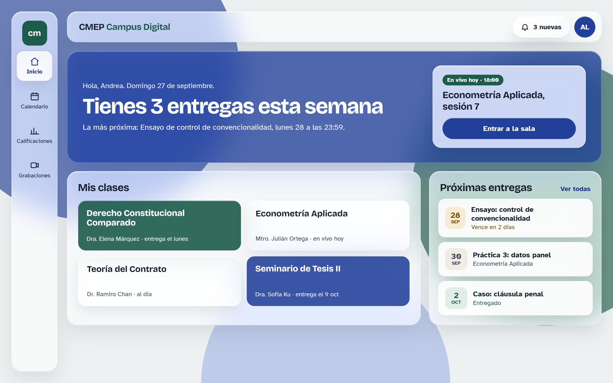

# DESIGN — Sistema visual de CMEP Campus Digital

> **Fuente única del sistema visual:** principios, tokens con valor y uso, materiales, tipografía, forma y espacio, foco y contraste, patrones, densidad por rol y tono de los textos.
> Las reglas técnicas (cómo se consumen los tokens en el código, qué componentes existen) están en `CLAUDE.md`, "Sistema de diseño". Lo que se lee y cuándo, en `AGENTS.md`.
> **Todo patrón visual nuevo que cree un encargo se documenta aquí en ese mismo encargo, y el manager lo verifica.**

| Campo | Valor |
|---|---|
| Dirección | **D3 · Vidrio líquido con fondo flotante**, elegida por el humano. Referencia: `docs/design/referencia-direccion-d3.png` |
| Antecedente | Dirección C (papel crema, tinta y superficies planas con bordes), elegida el 2026-09-26 y reemplazada por D3. Su captura se conserva en `docs/design/referencia-direccion-c.png`. Decisión en `docs/ARCHITECTURE.md` §20, D-28 |
| Registrado | 2026-09-27 |
| Estado de aplicación | DESIGN-01a, cerrado el 2026-09-27: tokens, materiales con su respaldo sólido, fuentes, `components/ui/` y botón en espera, aplicados en `frontend/src/styles/tokens.css` y los componentes base; incluye el borde de los campos y la corrección del rectángulo grisáceo del login, decididos por el humano tras su comprobación parcial. DESIGN-01b-1 (2026-09-27): fondo con orbes, movimiento, marco, composición, pie y recorte de la sombra. Pendiente: botón de contraseña (01b-2) y la comprobación visual completa. La comprobación visual completa (H-01 a H-17 y la tabla de contraste) se hace una sola vez, después de DESIGN-01b: en 01a el humano solo comprobó el bloque del login (fuentes, materiales y foco), sin orbes detrás |
| Marcas | **captura**: medido en la referencia. **humano**: valor dictado por el humano al elegir D3. **propuesta aprobada (2026-09-27)**: no aparece en la captura ni en lo dictado; se propuso al escribir este documento y el humano lo aprobó el 2026-09-27. La marca se conserva para saber de dónde salió cada valor. **propuesta**: valor nuevo que el humano aún no aprueba; lo confirma o corrige el encargo que lo aplique |

## 1. Referencia

La captura muestra el dashboard del estudiante en una ventana de 1280 × 800 px (la imagen, de 2560 × 1600, está a densidad 2x). Los colores se midieron pixel a pixel; los tamaños y las distancias, sobre la imagen, redondeados a la escala de 4 px.

La medición confirma el orden de las capas del fondo: el velo va **encima** de los orbes. El orbe azul se ve `#6A7EB4`, y `#22409A` bajo el velo da `#6C7FB8`. El fondo sin orbes se ve `#EEF1F1`, y `#E9EEF3` bajo el velo da `#EEF1F2`.

Los textos de la captura son ilustrativos: mandan los del PRD. Por ejemplo, la barra lateral dice "Calificaciones", no "Notas".

**Qué se conserva de la dirección C:** la tinta del texto, el azul real como acción principal, el verde pino de la marca, los colores suaves de estado, las tres familias tipográficas y el tono. **Qué cambia:** el fondo, las superficies (vidrio en lugar de papel plano con bordes), los radios, los botones en píldora, el botón tinta sobre el bloque destacado, que desaparece, y el borde tinta de los campos, más claro desde el cierre de DESIGN-01a (§3, §5).

## 2. Principios

1. **La legibilidad manda sobre el efecto.** El vidrio y el movimiento existen mientras el texto se lea con holgura. Si una combinación no llega a AA en el peor caso, cambia la superficie, no el requisito (§3, "Contraste verificado").
2. **Vidrio sobre color en movimiento lento.** Paneles de vidrio translúcido sobre un fondo claro con tres orbes de color que se desplazan despacio. El texto nunca toca el fondo: siempre va sobre vidrio o sobre una superficie sólida.
3. **Lo siguiente, primero.** Cada vista abre con lo que la persona tiene que hacer después, dicho con dato, fecha y hora: "Tienes 3 entregas esta semana". Hay un solo bloque destacado y una sola acción principal por vista.
4. **Tinta y dos colores con oficio.** Tinta azul noche para el texto. El azul real es la acción principal, el énfasis y la navegación; el verde pino, la marca y lo logrado. No hay grises neutros: el fondo y los suaves tienen tinte.
5. **La tipografía jerarquiza.** Títulos pesados con interletraje cerrado. El tamaño y el peso ordenan la página, no el color.
6. **El estado se dice con palabras.** "Vence en 2 días", "Entregado", "3 nuevas". El color refuerza el mensaje, nunca lo sustituye.
7. **Calma según el rol; lo denso, opaco.** El estudiante tiene aire y vidrio. Donde se trabaja con tablas (gradebook y administrador) no hay vidrio: las superficies son opacas (§7.2 y §8).

Referencias de carácter (PRD §7): Notion (editorial y cálido), Arc Browser (personalidad propia) y Linear (orden y jerarquía). Google Classroom es referencia solo de arquitectura de información, nunca de estilo.

## 3. Color

### Tokens

**Base**

| Token | Valor | Uso | Origen |
|---|---|---|---|
| `--background` | `#E9EEF3` | Color base del fondo, debajo de los orbes y del velo (§7.1) | humano |
| `--background-veil` | `rgb(247 245 239 / 0.35)` | Velo encima de los orbes. **Obligatorio**: sin él, varios textos sobre vidrio no llegan a AA (§3, "Contraste verificado") | humano; orden de capas por captura |
| `--surface` | `#FFFFFF` | Superficies opacas: campos, tablas, capas flotantes, pantallas densas. Respaldo sólido del vidrio y del vidrio fuerte | captura |
| `--foreground` | `#16202E` | Texto principal y títulos. Tinta del borde de 2 px del botón `outline` en contexto opaco (§7.3, §8) | captura |
| `--muted` | `#EFECE3` | Fondos sutiles sólidos: cuadro de fecha neutro, encabezado de tabla, fila bajo el cursor en superficies opacas | captura |
| `--muted-foreground` | `#3D4654` | Texto secundario y metadatos | captura |
| `--border` | `#DDD8CB` | Bordes que separan en superficies opacas: tablas y divisores. **No delimita controles** (§6) | dirección C |
| `--field-border` | `#5A6472` | Borde de 1 px de campos, selects y casillas (se usa a través de `--input`) | criterio (1 px, más claro que la tinta, 3:1 contra el vidrio en el peor caso, `--accent` al enfocar): decisión del humano (2026-09-27). Valor y nombre del token: propuesta (cierre de DESIGN-01a) |
| `--input` | `#5A6472` (apunta a `--field-border`) | Contorno de 1 px de campos, selects y casillas. Al enfocar, el borde pasa a `--accent`, con el mismo grosor | ver `--field-border` |

**Acción, énfasis y marca**

| Token | Valor | Uso | Origen |
|---|---|---|---|
| `--primary` / `--primary-foreground` | `#22409A` / `#FFFFFF` | Botón de la acción principal de la vista. Una por vista. **Siempre azul real con texto blanco, nunca tinta**, también dentro del bloque destacado | captura; humano |
| `--accent` / `--accent-foreground` | `#22409A` / `#FFFFFF` | Tarjeta de clase azul, avatar, orbe azul y color del vidrio azul | captura |
| `--accent-soft` | `#E1E7F7` | Texto secundario sobre `--accent` sólido (tarjeta de clase azul). **No va sobre vidrio azul** (§3, "Contraste verificado") | captura |
| `--accent-soft-glass` | `#E8ECF8` | Texto secundario sobre vidrio azul: saludo y siguiente paso del bloque destacado | captura; como token, propuesta aprobada (2026-09-27) |
| `--link` | `#1B3480` | Enlaces ("Ver todas") y elemento activo de la barra lateral | humano; captura |
| `--brand` / `--brand-foreground` | `#1D5B4B` / `#FFFFFF` | Monograma, "Campus Digital" en la barra superior, tarjeta de clase verde, insignia "En vivo" y orbe verde | captura |
| `--brand-soft` | `#E1EEE8` | Texto secundario sobre `--brand` | captura |
| `--ring` | `#22409A` (apunta a `--accent`) | Anillo de foco sobre vidrio y superficies claras (§6) | captura |

**Estados**

| Token | Valor | Uso | Origen |
|---|---|---|---|
| `--success` / `--success-soft` | `#1D5B4B` / `#E1EEE8` | "Al corriente", entregado, calificado | captura |
| `--warning` / `--warning-soft` | `#7A4F09` / `#F6EBD3` | Con retraso, fecha límite próxima, alumno en riesgo. `#7A4F09` sustituye al `#8A5A0B` de C, que no llega a AA sobre vidrio | humano; captura |
| `--danger` / `--danger-soft` | `#A3341F` / `#F7E4DE` | "Deudor", sin entregar, acceso restringido. **Nunca como texto sobre vidrio al 62 %** | decidido y aprobado por el humano el 2026-09-27 (razón en "Contraste verificado") |
| `--destructive` / `--destructive-foreground` | `#A3341F` / `#FFFFFF` | Errores y acciones destructivas (borrar, dar de baja, restringir). **Nunca como texto sobre vidrio al 62 %** | decidido y aprobado por el humano el 2026-09-27 (razón en "Contraste verificado") |

- `--primary` y `--accent` comparten valor, pero no uso. `--primary` es solo el botón de la acción principal; `--accent`, la identidad azul (tarjeta, avatar, vidrio azul).
- `--link` es más oscuro que `--accent` para mantener AA sobre vidrio con margen.
- Los botones rellenos (`primary` y `destructive`) llevan texto blanco `#FFFFFF`.
- `--brand` y `--success` comparten valor, pero no significado: la marca y la identidad de una clase no comunican estado.
- Los derivados que shadcn espera (`--card`, `--popover`, `--secondary`, `--input`, `--ring`…) apuntan a un token de esta tabla o de "Materiales", nunca a un valor propio.
- Tokens nuevos de la dirección C, aceptados por el humano y vigentes: `--accent-soft`, `--brand`, `--brand-foreground`, `--brand-soft`, `--success-soft`, `--warning-soft` y `--danger-soft`.
- **`--field-border` y `--input` (cierre de DESIGN-01a):** `--input` ya no apunta a `--foreground`. El borde de 2 px color tinta resultaba demasiado pesado, y al enfocar el anillo azul quedaba encima del borde oscuro. El criterio del cambio —1 px, un color más claro que la tinta, 3:1 contra el vidrio en el peor caso y `--accent` al enfocar, con el mismo grosor— es decisión del humano (2026-09-27); el valor `#5A6472` y el nombre del token nuevo, `--field-border`, son propuesta de este cierre, sin confirmar todavía. `--input` apunta a `--field-border` con `var()`, como `--ring` apunta a `--accent`. El botón `outline` en contexto opaco del administrador conserva la tinta con el token `--foreground` directamente (no con `--input` ni `--field-border`), así que su aspecto no cambió.
- Tokens nuevos de D3: `--background-veil`, `--link`, `--accent-soft-glass` y los de "Materiales". Cambian de valor respecto de C: `--background` (antes `#F7F5EF`), `--accent-foreground` y `--brand-foreground` (antes `#F7F5EF`) y `--warning` (antes `#8A5A0B`).
- **Derivados (DESIGN-01a, propuesta):** `--card` y `--popover` apuntan a `--surface`, no a un token de vidrio: `Card` pinta el vidrio con la utilidad `vidrio` (no con `bg-card`), y así un componente futuro de shadcn que use `bg-card` sin la utilidad no pinta vidrio sin desenfoque.
- **Tokens nuevos de implementación (DESIGN-01a, propuesta):** `--glass-filter: blur(28px) saturate(170%)`, `--glass-strong-filter: blur(32px) saturate(170%)`, `--glass-accent-filter: blur(30px) saturate(170%)` (los filtros de "Materiales", como variables propias para el respaldo sin `backdrop-filter` y el contexto opaco); `--control-height` (altura de los controles, §8).

### Materiales

Valores dictados por el humano al elegir D3, salvo los marcados como propuesta aprobada (2026-09-27).

| Material | Token | Valor | Uso |
|---|---|---|---|
| Orbe azul | `--orb-blue` | `--accent` (`#22409A`), 620 px, ciclo de 22 s | Fondo (§7.1) |
| Orbe verde | `--orb-green` | `--brand` (`#1D5B4B`), 560 px, ciclo de 26 s | Fondo (§7.1) |
| Orbe suave | `--orb-soft` | `#9FB3E6`, 520 px, ciclo de 30 s | Fondo (§7.1) |
| Vidrio | `--glass` | Blanco al 62 % (`rgb(255 255 255 / 0.62)`), `blur(28px) saturate(170%)` | Paneles, barra lateral y barra superior |
| Vidrio fuerte | `--glass-strong` | Blanco al 78 % (`rgb(255 255 255 / 0.78)`), `blur(32px)`; `saturate(170%)`, propuesta aprobada (2026-09-27) | Lo que va encima de otro vidrio: filas, tarjeta interna del bloque destacado, elemento activo de la barra lateral, botones secundarios |
| Vidrio azul | `--glass-accent` | `#22409A` al 78 % (`rgb(34 64 154 / 0.78)`), `blur(30px)`; `saturate(170%)`, propuesta aprobada (2026-09-27) | Bloque destacado |
| Borde del vidrio | `--glass-border` | 1 px blanco al 75 % (`rgb(255 255 255 / 0.75)`); el grosor de 1 px, propuesta aprobada (2026-09-27) | Vidrio y vidrio fuerte |
| Brillo del filo | `--glass-highlight` | Brillo interior en el filo superior: `inset 0 1px 0 rgb(255 255 255 / 0.9)`; el valor, propuesta aprobada (2026-09-27) | Vidrio, vidrio fuerte y vidrio azul |
| Sombra del vidrio | `--shadow-glass` | Sombra suave: `0 8px 32px rgb(22 32 46 / 0.08)`; el valor, propuesta aprobada (2026-09-27) | Vidrio, vidrio fuerte y vidrio azul |

- **Ninguna opacidad de vidrio baja del 60 %.**
- **Sin `backdrop-filter`** (el navegador no lo soporta): el vidrio y el vidrio fuerte pasan a `--surface` (`#FFFFFF`) y el vidrio azul a `--accent` (`#22409A`), sólidos. Safari necesita además el prefijo `-webkit-backdrop-filter`.
- Los orbes son círculos planos de color sólido, sin brillo ni desenfoque propio. Se ven suaves por el velo y por el vidrio que pasa encima, no por un efecto propio.
- **Implementación (DESIGN-01a, propuesta):** utilidades `vidrio`, `vidrio-fuerte` y `vidrio-azul` en `tokens.css`, con su respaldo sin `backdrop-filter` mediante `@supports not`. Las pantallas densas (hoy, todo `/admin`) marcan su contenedor con `data-material="opaco"`: el vidrio pasa a `--surface` sin tocar ningún componente. `backdrop-blur-*` de Tailwind queda anulado: nadie puede fabricar vidrio fuera de estas utilidades.
- **Implementación (DESIGN-01b, propuesta):** tokens `--orb-blue-size` (620px), `--orb-green-size` (560px), `--orb-soft-size` (520px), `--orb-blue-cycle` (22s), `--orb-green-cycle` (26s) y `--orb-soft-cycle` (30s); estilos del fondo por atributos (`data-fondo`, `data-orbe`, `data-velo`, `data-movimiento`) en `tokens.css`, sin ninguna clase. Sin `--color-background-veil`: el velo se usa como variable CSS, no como utilidad de Tailwind.

### Contraste verificado

Razones de contraste WCAG 2.2. Todo par nuevo se verifica y se agrega aquí. Los valores se redondean hacia abajo.

**Sobre superficies sólidas**

| Texto / fondo | Contraste |
|---|---|
| `--foreground` / `--surface` · `--background` | 16.4 · 14.0 |
| `--muted-foreground` / `--surface` · `--background` · `--muted` | 9.5 · 8.1 · 8.0 |
| `--primary-foreground` / `--primary` (también `--accent-foreground` / `--accent`) | 9.2 |
| `--accent-soft` / `--accent` (tarjeta de clase azul) | 7.4 |
| `--accent-soft-glass` / `--accent` (respaldo sólido del bloque destacado) | 7.8 |
| `--link` / `--surface` · `--muted` · `--accent-soft` | 11.3 · 9.6 · 9.1 |
| `--brand-foreground` / `--brand` | 7.9 |
| `--brand-soft` / `--brand` | 6.6 |
| `--success` / `--surface` · `--success-soft` | 7.9 · 6.6 |
| `--warning` / `--surface` · `--warning-soft` · `--muted` | 7.1 · 6.0 · 6.0 |
| `--danger` / `--surface` · `--background` · `--danger-soft` | 6.8 · 5.8 · 5.5 |
| `--destructive-foreground` / `--destructive` | 6.8 |
| `--destructive` / `--danger-soft` (error de un campo, `ErrorDeCampo`; DESIGN-01a, propuesta) | 5.5 |
| Anillo de foco interior `#FFFFFF` sobre `--primary` (propuesta aprobada (2026-09-27), confirmada en H-04) · `--destructive` (todavía propuesta; el humano no vio un botón rojo) | 9.2 · 6.8 |
| Borde de campo `--field-border` (3:1) / `--surface` · `--background` — criterio: decisión del humano (2026-09-27); valor: propuesta (cierre de DESIGN-01a) | 6.0 · 5.1 |

**Sobre vidrio, contra el peor caso.** El cálculo compone las capas como las pinta el navegador:

1. Se toma como fondo el orbe más desfavorable, bajo el velo.
2. Encima se aplica la saturación del vidrio.
3. Sobre eso se pinta el color del vidrio.

Como la saturación puede aplicarse en sRGB o en espacio lineal, el cálculo toma el peor de tres resultados: saturación en sRGB, en lineal o sin aplicar. El desenfoque no cambia el color en el interior de una zona uniforme, y los orbes miden 520 px o más.

Para el texto oscuro, el peor caso es el orbe azul `#22409A`, el más oscuro. Para el texto claro sobre vidrio azul, es el fondo sin orbes.

| Texto | Vidrio (62 %) | Vidrio fuerte (78 %) | Vidrio fuerte sobre vidrio azul (tarjeta interna) |
|---|---|---|---|
| `--foreground` `#16202E` | 10.4 | 12.7 | 11.2 |
| `--muted-foreground` `#3D4654` | 6.0 | 7.3 | 6.5 |
| `--link` `#1B3480` | 7.2 | 8.8 | 7.8 |
| `--warning` `#7A4F09` | 4.5 | 5.5 | 4.9 |
| `--success` / `--brand` `#1D5B4B` | 5.0 | 6.1 | 5.4 |
| `--danger` `#A3341F` | **4.3, no pasa** | 5.3 | 4.7 |
| Contorno de campo `--field-border` (3:1) — criterio: decisión del humano (2026-09-27); valor: propuesta (cierre de DESIGN-01a) | 3.8 | 4.6 | 4.1 |
| Anillo de foco `--ring` (3:1) | 5.8 | 7.1 | 6.3 |
| `--danger` como icono (no texto, 3:1; DESIGN-01a, propuesta) | 4.3 | 5.3 | 4.7 |

| Texto sobre vidrio azul (78 %) | Contraste |
|---|---|
| `#FFFFFF` (titular, anillo de foco) | 5.4 |
| `--accent-soft-glass` `#E8ECF8` | 4.5 |
| `--accent-soft` `#E1E7F7` | **4.3, no pasa** |

Qué se sigue de las tablas:

- **El rojo nunca va como texto directamente sobre vidrio al 62 %** (regla aprobada por el humano el 2026-09-27). Va sobre vidrio fuerte, sobre una superficie sólida o dentro de una insignia o alerta con fondo `--danger-soft`. Esto incluye el mensaje de error de un campo: debajo del campo, sobre una superficie que lo sostenga (§7.3).
- **Sobre vidrio azul, el texto secundario va en `--accent-soft-glass`**, medido en la captura, y no en `--accent-soft`.
- **El velo es obligatorio.** Sin él, en el peor caso sobre vidrio, el aviso baja a 3.4, el verde a 3.8 y el rojo a 3.3.
- **`--warning` cambió por esto:** el `#8A5A0B` de C da 3.7 sobre vidrio y `#7A4F09` da 4.5. Es el par con menos margen: si cambia el vidrio o el velo, se recalcula primero.
- El texto oscuro sobre vidrio fuerte colocado encima de otro vidrio da más contraste que la columna "Vidrio fuerte", que supone el caso sin vidrio debajo.

**Rojo de `--danger` y `--destructive`.** Entre `#A33A2B` y `#A3341F` se elige `#A3341F` porque da más contraste en todos los pares:

| Par | `#A33A2B` | `#A3341F` |
|---|---|---|
| Sobre `--danger-soft` (el sólido más justo) | 5.3 | 5.5 |
| Sobre `--surface` | 6.5 | 6.8 |
| Texto blanco sobre el rojo | 6.5 | 6.8 |
| Sobre vidrio fuerte, peor caso | 5.0 | 5.3 |
| Sobre la tarjeta interna del bloque destacado, peor caso | 4.5 | 4.7 |
| Sobre vidrio (62 %), peor caso | 4.1 | 4.3 |

Solo `#A3341F` conserva margen sobre la tarjeta interna, y ninguno de los dos llega a 4.5 sobre vidrio (62 %). De ahí la regla anterior. `--danger` y `--warning` tienen una luminosidad casi igual: se distinguen por tono y, sobre todo, por su texto. Por eso el estado nunca va solo en color.

**Nota (DESIGN-01a):** `frontend/src/styles/tokens.test.ts` recalcula cada par de esta sección con el método descrito arriba (composición de capas, saturación en sRGB y en lineal, peor de los tres resultados) y falla si algún par no llega a su umbral. Si una prueba de contraste se detiene, el error es de este documento y lo decide el humano; no se cambia un token para que la prueba pase.

`--border` da 1.4:1 contra `--surface`: basta para separar superficies, pero no para delimitar un control, que necesita 3:1. Por eso los campos usan `--input`.

## 4. Tipografía

### Familias

Decididas por el humano el 2026-09-26 y confirmadas para D3 el 2026-09-27.

| Rol | Token | Familia | Pesos | Paquete |
|---|---|---|---|---|
| Títulos | `--font-heading` | Bricolage Grotesque | 500 y 700 | `@fontsource/bricolage-grotesque` |
| Texto | `--font-sans` | Atkinson Hyperlegible Next | 400, 500 y 700 | `@fontsource/atkinson-hyperlegible-next` |
| Códigos de clase | `--font-mono` | Atkinson Hyperlegible Mono | 500 | `@fontsource/atkinson-hyperlegible-mono` |

- **Bricolage Grotesque** viene de la dirección C y se conserva en D3.
- **Atkinson Hyperlegible Next**, del Braille Institute, está diseñada para distinguir letras y cifras parecidas (I, l y 1; O y 0).
- **Atkinson Hyperlegible Mono** es de la misma familia: en un código de clase, confundir la O con el 0 es un error real.

**Paquetes verificados en npm el 2026-09-27:** los tres existen, en la versión 5.3.0 y con licencia OFL-1.1. La verificación del 2026-09-26 encontró, además, los pesos del 200 al 800 en WOFF2 con el subconjunto latino, que incluye á, é, ñ, ¿ y ¡, y una versión variable de cada uno (`@fontsource-variable/…`).

**Reglas de carga:**
- Todas se autoalojan con Fontsource y se sirven desde el propio frontend. Nunca se cargan del CDN de Google Fonts, que no es proveedor aprobado.
- Instalar los paquetes es una dependencia nueva: la aprueba el humano en el encargo que aplique este documento.
- Se cargan solo los pesos de esta tabla.
- **Implementación (DESIGN-01a, propuesta aprobada (2026-09-27)):** seis importaciones en `frontend/src/main.tsx`, antes de `./styles/index.css` (para que Vite resuelva las `url()` relativas de cada `@font-face`): `@fontsource/bricolage-grotesque/latin-500.css` y `latin-700.css`; `@fontsource/atkinson-hyperlegible-next/latin-400.css`, `latin-500.css` y `latin-700.css`; `@fontsource/atkinson-hyperlegible-mono/latin-500.css`. Cada CSS de Fontsource suele declarar el mismo peso en `.woff2` y en `.woff`: en `dist/assets/` aparecen los `.woff2` de estos seis pesos y, junto a ellos, sus `.woff` de respaldo.

**H-01, resultado (2026-09-27):** el humano las vio en pantalla, en `/diagnostico` y en `/login`, a 1280 y a 360 px, y las aprobó:

1. Solo archivos `.woff2` servidos por el propio origen, sin `fonts.googleapis.com` ni `fonts.gstatic.com`.
2. "Atkinson Hyperlegible Next" en el texto y "Bricolage Grotesque" en los títulos.
3. Cifras tabulares (`tabular-nums`) en Atkinson Hyperlegible Next.
4. Lectura cómoda a 16 px y a 360 px de ancho.

El resto de la comprobación de pantallas (H-02 en adelante) queda para la comprobación completa después de DESIGN-01b.

### Escala

En `@theme`, cada tamaño es un token `--text-*` con sus variantes `--line-height`, `--font-weight` y `--letter-spacing`. La escala no cambia respecto de la dirección C.

| Token | Tamaño / interlineado | Peso | Interletraje | Familia | Uso |
|---|---|---|---|---|---|
| `--text-display` | 44 px / 1.05 | 700 | `-0.03em` | títulos | Titular del bloque destacado; uno por vista. A menos de 640 px baja a 32 px |
| `--text-h1` | 28 px / 1.15 | 700 | `-0.02em` | títulos | Título de página; propuesta aprobada (2026-09-27) |
| `--text-h2` | 22 px / 1.2 | 700 | `-0.015em` | títulos | Título de sección ("Mis clases") y día del cuadro de fecha |
| `--text-h3` | 18 px / 1.3 | 500 | `-0.01em` | títulos | Título de tarjeta. El nombre del producto en la barra superior usa este tamaño en 700 |
| `--text-body` | 16 px / 1.5 | 400 | 0 | texto | Texto corrido y campos. Título de fila de entrega, en 700 |
| `--text-small` | 14 px / 1.45 | 400 o 500 | 0 | texto | Metadatos, texto secundario y celdas de tabla. Botones, en 700 |
| `--text-caption` | 12 px / 1.35 | 500 o 700 | 0; +0.04em en mayúsculas | texto | Etiquetas de la barra lateral, insignias, mes del cuadro de fecha |

- El interletraje va en valores CSS literales, con el guion ASCII como signo menos (`-0.03em`). El signo tipográfico `−` no es CSS válido y el navegador ignoraría la declaración sin avisar.
- La familia de títulos solo se usa en 500 y 700.
- Ningún texto mide menos de 12 px.
- Cifras tabulares (`tabular-nums`) en tablas, calificaciones, gradebook, cuadros de fecha y horas.
- Mayúsculas solo en etiquetas de una o dos palabras, como el mes del cuadro de fecha.
- El texto corrido no pasa de unos 70 caracteres por línea (`max-width: 65ch`).

## 5. Forma y espacio

### Radios

Cada tipo de elemento tiene su radio. Los radios por defecto de Tailwind y de shadcn no se usan.

| Token | Valor | Uso | Origen |
|---|---|---|---|
| `--radius-hero` | 24 px | Bloque destacado | humano |
| `--radius-panel` | 22 px | Paneles, barra lateral y tarjeta interna del bloque destacado | humano |
| `--radius-bar` | 20 px | Barra superior | humano |
| `--radius-card` | 16 px | Tarjetas de clase | humano |
| `--radius-row` | 14 px | Filas de lista y elementos de navegación | humano |
| `--radius-date` | 12 px | Cuadros de fecha | humano |
| `--radius-pill` | 999 px | Etiquetas, insignias y botones (píldora) | humano |
| — | círculo (`rounded-full`) | Avatares | humano |

Elementos sin radio dictado, todos propuesta aprobada (2026-09-27):
- Campos y selects: 14 px (`--radius-row`).
- Menús, popovers, selects abiertos y avisos: 14 px.
- Diálogos y contenedor de tabla: 22 px (`--radius-panel`).
- Monograma: 16 px.
- Casillas: 6 px.

### Bordes

- **1 px `--glass-border`** (blanco al 75 %): vidrio y vidrio fuerte.
- **1 px `--input`** (apunta a `--field-border`, más claro que la tinta): campos, selects y casillas. Es el borde que delimita un control. Al enfocar, pasa a `--accent` con el mismo grosor (§6, §7.3). El criterio —1 px, más claro, 3:1 en el peor caso, `--accent` al enfocar— es decisión del humano (2026-09-27); el valor de `--field-border` es propuesta de este cierre.
- **2 px `--foreground`** (tinta): el botón `outline` en contexto opaco del administrador (§7.3, §8). No usa `--input`, que ahora es el borde de los campos.
- **1 px `--border`**: tablas y divisores sobre superficies opacas.

### Sombras

- **Vidrio, vidrio fuerte y vidrio azul:** `--shadow-glass` y el brillo `--glass-highlight` (§3, "Materiales").
- **Capas flotantes** (menú, popover, select abierto, diálogo y aviso de sonner): `--shadow-overlay: 0 8px 24px rgb(22 32 46 / 0.12)`, tinta al 12 %; propuesta aprobada (2026-09-27).
- **Superficies opacas de las pantallas densas:** sin sombra.
- Toda clase `shadow-*` por defecto de Tailwind o de shadcn se sustituye por uno de estos tokens o se elimina.

### Espaciado

La escala es la de Tailwind, múltiplos de 4 px (`--spacing: 0.25rem`). Medidas de la captura en escritorio:

| Elemento | Medida |
|---|---|
| Márgenes de la ventana | 24 px arriba, abajo y a los lados: la barra lateral y la barra superior flotan |
| Barra lateral | 96 px de ancho y todo el alto disponible |
| Entre la barra lateral y el contenido | 20 px |
| Barra superior | 64 px de alto; 24 px de relleno a la izquierda y 12 px a la derecha |
| Separación entre bloques | 20 px |
| Relleno del bloque destacado | 32 px arriba y abajo; 36 px a los lados |
| Tarjeta interna del bloque destacado | 320 px de ancho |
| Columnas del dashboard | proporción 2:1 (clases y entregas), con 20 px entre ellas |
| Relleno de los paneles | 24 px; en el panel de entregas, las filas quedan a 20 px del borde |
| Del título de sección a su contenido | 16 px |
| Tarjetas de clase | altura mínima de 104 px, 20 px de relleno y 12 px de separación |
| Filas de entrega | 16 px de relleno y 12 px de separación |

A menos de 640 px, los márgenes de la ventana bajan a 16 px; propuesta aprobada (2026-09-27).

**Implementación (DESIGN-01b, propuesta):** entre la barra superior, el contenido y el pie, 20 px para estudiante y maestro (el maestro tenía 24 px de separación intermedia: con los 20 px del estudiante, la escala de 4 px no deja un valor entre 16 y 20, así que el maestro pasa a compartir el del estudiante) y 16 px en el administrador (`ESPACIADO_POR_ROL`, `components/layout/data.ts`).

## 6. Foco, contraste y accesibilidad

- **Foco visible** en todo elemento interactivo, solo con `:focus-visible`: contorno sólido de 2 px, separado 2 px del elemento. Sobre vidrio, vidrio fuerte y superficies claras, en `--ring`. Sobre vidrio azul, `--accent` o `--brand` (bloque destacado, tarjetas de clase de color, botón `primary`), en `#FFFFFF`. Nunca se quita el contorno sin poner otro en su lugar.
  - **Botones rellenos (`primary`, DESIGN-01a, propuesta aprobada (2026-09-27), confirmada en H-04; `destructive`, mismo mecanismo, todavía propuesta: el humano no vio un botón rojo en el bloque del login):** un contorno blanco por fuera del botón quedaría sobre vidrio claro y no se vería. El contorno va 4 px hacia dentro (`-outline-offset-4`) y en el color del texto del botón (`--primary-foreground` o `--destructive-foreground`, ambos `#FFFFFF`): 9.2:1 y 6.8:1 contra el fondo del botón. El mecanismo de foco blanco para otras superficies de color (bloque destacado, tarjetas de clase) lo construye el encargo que las cree.
- **Contraste mínimo:** 4.5:1 en texto normal; 3:1 en texto grande (24 px o más, o 18.66 px en 700), en bordes de controles y en el indicador de foco. Sobre vidrio se verifica contra el peor caso (§3).
- **Texto nunca directo sobre el fondo con orbes.** Siempre sobre vidrio o sobre una superficie sólida.
- **Controles:** los campos llevan borde `--input`. Los botones se identifican por su texto; su borde de vidrio no necesita 3:1 (WCAG 1.4.11 no lo exige cuando el texto identifica el control).
- **Tamaño de los objetivos:** 44 × 44 px en las vistas de estudiante y maestro; en las pantallas densas, 36 px desde 768 px de ancho y 44 px por debajo de ese corte (decisión del humano, 2026-09-27; el corte de 768 px, propuesta: coincide con el punto en que la barra lateral pasa a barra inferior, §7.4). WCAG 2.2 pide al menos 24 px.
- **Estado** siempre con texto o icono, además del color.
- **Movimiento:**
  - Las transiciones de la interfaz duran 150 ms o menos y solo cambian color y fondo.
  - La única animación decorativa son los orbes del fondo, con sus reglas (§7.1).
  - Con `prefers-reduced-motion: reduce`, los orbes quedan quietos y el indicador de carga deja de girar y conserva su texto.
- **Sin `backdrop-filter`**, las superficies de vidrio pasan a sólidas (§3, "Materiales"). La interfaz sigue siendo legible y usable sin el efecto.
- **Botones con una petición en vuelo (DESIGN-01a, propuesta):** el patrón es `enEspera` en `Button` (`components/ui/button.tsx`), nunca `disabled`:
  1. El botón no lleva `disabled`; lleva `aria-disabled="true"` y `aria-busy="true"`, conserva el foco y sigue en el orden de tabulación.
  2. Su `onClick` intercepta el evento (`preventDefault`, sin llamar al manejador recibido): cubre el clic, Enter y Espacio sobre el botón, y el envío implícito con Enter desde un campo.
  3. Muestra un indicador de carga (`LoaderCircle`, `aria-hidden`, `motion-reduce:animate-none`) antes del texto; el texto y el nombre accesible no cambian.
  4. El doble envío queda cubierto en capas: el clic interceptado, la guarda del manejador (`if (mutacion.isPending) return`) y, donde hace falta un candado síncrono entre el clic y el primer repintado, una referencia (`enviandoRef`).
  `disabled` queda para un control que no está disponible, no para una petición en vuelo.

## 7. Patrones

### 7.1 Fondo con orbes

**Capas, de abajo arriba:**
1. `--background` (`#E9EEF3`).
2. Los tres orbes.
3. El velo `--background-veil`.
4. El contenido, siempre sobre vidrio o sólido.

El fondo ocupa toda la ventana, queda fijo detrás del contenido, no recibe el puntero y es invisible para los lectores de pantalla.

**Orbes**

| Orbe | Color | Diámetro | Ciclo | Posición en la captura |
|---|---|---|---|---|
| Azul real | `--orb-blue` | 620 px | 22 s | Arriba a la izquierda, detrás de la barra lateral |
| Verde pino | `--orb-green` | 560 px | 26 s | A la derecha, a media altura, cortado por el borde |
| Azul suave | `--orb-soft` | 520 px | 30 s | Abajo al centro, cortado por el borde |

- **Animación:** cada orbe se desplaza y escala en un ciclo infinito de ida y vuelta, con `ease-in-out`, **solo con `transform`**. Nunca se animan el color, la opacidad, el tamaño en px ni un desenfoque. La amplitud es propuesta aprobada (2026-09-27): hasta 60 px de desplazamiento y escala entre 0.92 y 1.08.
- **Rendimiento:** solo los orbes llevan `will-change: transform`. No se agregan más orbes ni capas animadas.
- **Movimiento reducido:** con `prefers-reduced-motion: reduce`, los orbes quedan quietos en su posición de la captura (`animation: none`).
- **Posición y trayectoria (DESIGN-01b, propuesta; S-05):** medidas sobre la captura de 1280 × 800. Azul con centro en (190, 150) px de la ventana; verde con centro a 1144 px del borde izquierdo y a media altura; suave con centro horizontal cerca del medio y solo 122 px visibles abajo. El 0 % del ciclo es la posición de la captura; el desplazamiento máximo es de 60 px y la escala va de 0.92 a 1.08, con `alternate` para la ida y vuelta.
- **Cómo se decide el movimiento (DESIGN-01b):** `orbesEnMovimiento(pathname)` (`components/layout/lib.ts`) compara la ruta actual, sin distinguir mayúsculas y sin la barra final, contra `RUTAS_CON_ORBES_EN_MOVIMIENTO` (`components/layout/data.ts`; S-03).
- **Pantallas quietas: pausadas, no detenidas (S-04):** en una pantalla sin movimiento los orbes se pausan (`animation-play-state: paused`), así que al llegar desde una pantalla en movimiento se detienen donde estaban, sin salto; al entrar directo quedan en su posición de la captura.
- **Montaje (DESIGN-01b):** el fondo se monta una sola vez, fuera del router (`app/fondo-de-la-app.tsx`, montado en `main.tsx`), así no se reinicia al navegar y se ve también mientras las guardas cargan.

**Alcance por pantalla**

| Pantallas | Orbes | Superficies | Rutas hoy (DESIGN-01b) |
|---|---|---|---|
| Login e inicio de estudiante y de maestro (dashboards; hoy, la bienvenida provisional) | En movimiento | Vidrio | `/login`, `/estudiante`, `/maestro` |
| Pantallas de trabajo: detalle de tarea, calificar, calendario y clase en vivo | Quietos | Vidrio | — |
| Gradebook y todas las vistas del administrador | Quietos; propuesta aprobada (2026-09-27) | **Opacas: sin vidrio** | `/admin` |
| Demás pantallas: registro, recuperar, restablecer y establecer contraseña, cambio obligatorio, acceso restringido y diagnóstico | Quietos | Vidrio | `/registro`, `/recuperar`, `/restablecer`, `/establecer-contrasena`, `/cambiar-contrasena`, `/acceso-restringido`, `/diagnostico` |

Una pantalla nueva que no esté en la tabla tiene los orbes quietos. Su encargo la agrega aquí.

### 7.2 Superficies de vidrio

| Superficie | Material | Dónde |
|---|---|---|
| Panel | Vidrio (62 %), `--radius-panel` | Paneles de contenido ("Mis clases", "Próximas entregas"), formularios de las pantallas de cuenta |
| Barra lateral | Vidrio, `--radius-panel` | Marco (§7.4) |
| Barra superior | Vidrio, `--radius-bar` | Marco (§7.4) |
| Elemento sobre vidrio | Vidrio fuerte (78 %) | Filas, tarjeta de clase blanca, tarjeta interna del bloque destacado, elemento activo de la barra lateral, botones secundarios, píldora de avisos |
| Bloque destacado | Vidrio azul (78 %), `--radius-hero` | §7.5 |
| Superficie opaca | `--surface` | Pantallas densas, campos, capas flotantes |

**Reglas de legibilidad:**
- El texto nunca va directo sobre el fondo con orbes: siempre sobre vidrio o sólido.
- Ninguna opacidad de vidrio baja del 60 %.
- Enlaces en `--link`; texto de aviso en `--warning` (`#7A4F09`).
- El texto rojo no va sobre vidrio (62 %) (§3).
- Sobre vidrio azul, solo `#FFFFFF` y `--accent-soft-glass`.
- Todo par nuevo sobre vidrio se verifica contra el peor caso (§3) antes de usarse.
- En pantallas densas (gradebook y administrador) no hay vidrio.
- **Implementación (DESIGN-01a, propuesta):** cada material es una utilidad de `tokens.css` (`vidrio`, `vidrio-fuerte`, `vidrio-azul`), nunca `backdrop-blur-*` suelto. Una pantalla densa marca su contenedor con `data-material="opaco"` (`ContenedorRol`, solo para el rol `admin`): las tres utilidades quedan en `--surface` sin que sus consumidores cambien de clase.
- **Contenedor con desplazamiento propio (DESIGN-01b, propuesta; sustituye al alivio parcial de 01a):** las superficies de vidrio dentro de un contenedor con `overflow` propio no llevan sombra (utilidad `sin-sombra-de-vidrio` en el contenedor, que redefine `--shadow-glass`; se quedan el borde y el brillo del filo). La sombra la da el panel que lo contiene, que no está dentro de ningún recorte. Así la sombra nunca se corta en seco.
- **Lo fijo nunca dentro del vidrio (DESIGN-01b):** un `backdrop-filter` convierte a su elemento en bloque contenedor de lo fijo (`position: fixed`) que tenga dentro. El fondo con orbes se monta fuera del router, y la barra inferior cuelga de un contenedor sin vidrio.
- **Panel de anuncios del login (DESIGN-01b, propuesta):** panel de vidrio con una lista desplazable de filas de vidrio fuerte (`sin-sombra-de-vidrio` en la lista), con nombre accesible del título y enfocable con Tab; compacto arriba en móvil (RF-06).
- **Pantallas de cuenta (DESIGN-01b, propuesta):** panel de vidrio centrado en la ventana, con el monograma (`Monograma`) encima del título.

### 7.3 Controles

| Variante | Aspecto | Cuándo |
|---|---|---|
| `primary` | Fondo `--primary` (azul real, sólido), texto `--primary-foreground` (blanco) en 700, píldora | La acción principal; una por vista. También dentro del bloque destacado |
| `outline` (por defecto) | Vidrio fuerte, borde `--glass-border`, texto `--foreground` en 700, píldora | Todo lo demás. En pantallas densas: fondo `--surface` con borde 2 px `--foreground` (tinta); propuesta aprobada (2026-09-27); el token cambió de `--input` a `--foreground` en el cierre de DESIGN-01a, porque `--input` pasó a ser el borde, más claro, de los campos |
| `destructive` | Fondo `--destructive` (sólido), texto `--destructive-foreground`, píldora | Borrar, dar de baja, restringir |
| `ghost` | Sin fondo ni borde; vidrio fuerte bajo el cursor (en pantallas densas, `--muted`) | Acciones terciarias en línea |
| `link` | Texto `--link`, subrayado bajo el cursor | Navegación dentro del texto ("Ver todas") |

- Los botones miden 44 px de alto (`--control-height`); en pantallas densas, 36 px desde 768 px de ancho y 44 px por debajo (§6, §8); en acciones en línea, 36 px fijo (tamaño `sm`). Texto `--text-small` en 700.
- **No hay botón tinta.** El botón sobre el bloque destacado de la dirección C desaparece: la acción principal del bloque va en `primary` azul sobre la tarjeta interna de vidrio fuerte (§7.5).
- Los campos miden 44 px de alto (36 px en pantallas densas desde 768 px de ancho; 44 px por debajo de ese corte, como en §6 y §8), con fondo `--surface` (sólido, también sobre vidrio), texto `--text-body` y etiqueta visible arriba.
- **Borde de un campo (cierre de DESIGN-01a):** 1 px `--input` (apunta a `--field-border`), más claro que la tinta (§3, §5); el criterio es decisión del humano (2026-09-27), el valor es propuesta de este cierre. Al enfocar, el borde pasa a `--accent`, con el mismo grosor, para que el campo no salte; el anillo de foco de §6 se queda, por fuera. Un campo inválido usa `--destructive` en vez de `--input`, con el mismo grosor: si se enfoca, conserva el borde `--destructive` y lleva el anillo azul por fuera.
- **Etiqueta de un campo (DESIGN-01a, propuesta):** `Label` (`components/ui/label.tsx`), `--text-small` en 700 sobre `--foreground`.
- **Error de un campo (DESIGN-01a, propuesta; decide entre las tres opciones que dejaba abierta esta sección):** `ErrorDeCampo` (`components/error-de-campo.tsx`) pinta el mensaje sobre un fondo `--danger-soft` sólido, con icono `CircleAlert` y `--destructive` como texto (5.5:1, "Contraste verificado"), en vez de texto rojo suelto. Así, el rojo no toca el vidrio (que no llega a AA sobre vidrio al 62 %) sin importar dónde esté el formulario en la pantalla.
- **`hover` (DESIGN-01a, propuesta; no estaba en este documento):** `primary` y `destructive`, su fondo al 90 %; `outline`, de vidrio fuerte a `--surface` (en pantallas densas, a `--muted`); `ghost`, a vidrio fuerte (en pantallas densas, a `--muted`).
- **Enlaces sueltos fuera de una frase** (por ejemplo, "¿Olvidaste tu contraseña?", "Crear cuenta"), que no entran en la excepción de objetivo mínimo de WCAG 2.5.8 por ir dentro de texto corrido: tamaño `enlace` de `Button`, con altura mínima de 44 px (DESIGN-01a, propuesta).

### 7.4 Marco: barra lateral y barra superior

Las dos barras flotan sobre el fondo, a 24 px de los bordes de la ventana.

**Barra lateral**

- 96 px de ancho, de vidrio, `--radius-panel`.
- Arriba va el monograma: 52 × 52 px, `--brand`, "cm" en `--brand-foreground`, a 20 px del borde superior de la barra. Es provisional hasta tener el logo del colegio (PRD §11).
- Elementos apilados de 72 × 60 px, `--radius-row` y 12 px entre ellos: icono de lucide de 20 px con su etiqueta en `--text-caption` debajo.
  - **Activo:** vidrio fuerte, icono y etiqueta en `--link` y `aria-current="page"`.
  - **Inactivo:** icono y etiqueta en `--foreground`; vidrio fuerte bajo el cursor.
- Solo muestra los destinos del rol. Los fija el encargo de cada módulo.
- Por debajo de 768 px pasa a una barra inferior fija de 64 px, de vidrio, con los mismos elementos; propuesta aprobada (2026-09-27).
- En pantallas densas, la barra es opaca (`--surface`) y el elemento activo usa `--accent-soft`; propuesta aprobada (2026-09-27).

**Barra superior**

- 64 px de alto, de vidrio, `--radius-bar`.
- A la izquierda, el nombre del producto en `--text-h3` 700: "CMEP" en `--foreground` y "Campus Digital" en `--brand`.
- A la derecha:
  - El botón de avisos: píldora de vidrio fuerte de 44 px de alto, con campana y conteo en palabras ("3 nuevas"). Nunca un punto de color sin texto.
  - El avatar: círculo de 44 px, `--accent`, iniciales en `--accent-foreground`.
- En pantallas densas, la barra es opaca (`--surface`); propuesta aprobada (2026-09-27).

**Implementación (DESIGN-01b, propuesta, salvo lo ya marcado como aprobado arriba):**
- Una sola `nav` (`BarraNavegacion`) que es la barra lateral desde 768 px y la barra inferior fija por debajo, flotante a 16 px de los bordes de la ventana, el margen de la ventana en pantallas angostas (§5); desde 768 px, la barra lateral y la barra superior flotan a 24 px, como dice el inicio de esta sección. Entre 640 y 767 px el margen también es de 16 px, y no de 24 como pide §5, porque cambia en el mismo corte que la barra (DESIGN-01b, propuesta), con elementos de 72 × 56 px en la barra inferior y 72 × 60 px en la barra lateral.
- Destinos de hoy: "Inicio" hacia `/estudiante` o `/maestro`, "Cuentas" hacia `/admin` (un solo destino por rol; `DESTINOS_POR_ROL`, `components/layout/data.ts`).
- Avatar decorativo (`AvatarUsuario`) con las iniciales de `inicialesDe(nombre)` (`lib/format.ts`).
- Sin botón de avisos todavía (llega con el módulo `notificaciones`).
- **Barra superior por debajo de 640 px (S-12):** no caben el nombre del producto, el avatar, el nombre de la persona y "Cerrar sesión" con texto. El nombre y el rol quedan solo para lectores de pantalla, el avatar se oculta y "Cerrar sesión" muestra solo su icono (su nombre accesible no cambia).

### 7.5 Bloque destacado

- Vidrio azul, `--radius-hero`, 32 px de relleno arriba y abajo y 36 px a los lados.
- **Anatomía, a la izquierda:**
  1. Saludo con la fecha, en `--text-small` y `--accent-soft-glass`.
  2. Titular con un dato, en `--text-display` y `#FFFFFF` (`--accent-foreground`).
  3. El siguiente paso concreto, con fecha y hora, en `--text-body` y `--accent-soft-glass`.
- **A la derecha (opcional):** una tarjeta interna de 320 px, de vidrio fuerte, `--radius-panel` y 24 px de relleno. Lleva una insignia, un título en `--text-h3` y `--foreground`, y el botón `primary` a todo el ancho. Ahí vive la acción principal de la vista.

Reglas:
- Uno por vista, siempre arriba. Aparece en los dashboards de estudiante y maestro; en las vistas del administrador no se usa.
- El titular siempre lleva un dato ("Tienes 3 entregas esta semana"), nunca un saludo genérico.
- A menos de 640 px, la tarjeta interna pasa debajo del texto y el titular baja a 32 px.
- El foco dentro del bloque usa el contorno `#FFFFFF`; dentro de la tarjeta interna, `--ring` (§6).

### 7.6 Tarjeta de clase

- Rejilla de 2 columnas (1 por debajo de 640 px) y 12 px de separación.
- Cada tarjeta: altura mínima de 104 px, 20 px de relleno y `--radius-card`.
- Título en `--text-h3`, de dos líneas como máximo.
- Abajo, una línea de metadatos en `--text-small`: docente y siguiente hito ("Dra. Elena Márquez · entrega el lunes"). Esa línea cumple la "siguiente fecha límite" de RF-10.
- La tarjeta entera es un enlace a la clase, y el foco va en la tarjeta.

Variantes. Indican la identidad de la clase, **nunca un estado**:

| Variante | Fondo | Título | Metadatos |
|---|---|---|---|
| Verde | `--brand`, sólido | `--brand-foreground` | `--brand-soft` |
| Azul | `--accent`, sólido | `--accent-foreground` | `--accent-soft` |
| Blanca | Vidrio fuerte | `--foreground` | `--muted-foreground` |

En la captura, las tarjetas verde y azul se ven al 90 % de opacidad aproximadamente. Aquí van sólidas para que su contraste no dependa de lo que haya detrás; propuesta aprobada (2026-09-27). La variante lavanda de la dirección C desaparece. Cómo se asigna la variante a cada clase lo decide el encargo de CLASES.

### 7.7 Fila de entrega con cuadro de fecha

- Lista vertical con 12 px entre filas.
- Cada fila: vidrio fuerte, `--radius-row` y 16 px de relleno. Es un enlace al detalle de la tarea.
- A la izquierda, el cuadro de fecha: 44 × 44 px, `--radius-date`, fondo sólido. El día va en `--text-h2` 700 con cifras tabulares; el mes, en `--text-caption` 700 y mayúsculas.
- A la derecha:
  1. El título de la tarea, en `--text-body` 700 y `--foreground`, con dos líneas como máximo.
  2. Una segunda línea con el estado en palabras o el nombre de la clase.

| Situación | Fondo del cuadro | Color de la cifra y del estado | Segunda línea |
|---|---|---|---|
| Pendiente | `--muted` | `--muted-foreground` | Nombre de la clase |
| Fecha límite próxima | `--warning-soft` | `--warning` | "Vence en 2 días" |
| Entregada o calificada | `--success-soft` | `--success` | "Entregado" / "Calificado" |
| Entregada con retraso | `--warning-soft` | `--warning` | "Entregado con retraso" |
| Sin entregar (vencida) | `--danger-soft` | `--danger` | "Sin entregar"; propuesta aprobada (2026-09-27) |

El texto de estado de la segunda línea va sobre la fila de vidrio fuerte, donde todos los colores de estado pasan AA (§3). El umbral de "fecha límite próxima" no está definido en el PRD. Lo fija el encargo de TAREAS y se anota aquí.

### 7.8 Etiqueta de estado

Tiene tres formas, y todas llevan palabras:

- **Insignia:** `--text-caption` 700, relleno de 4 × 8 px, píldora, fondo `*-soft` sólido y texto en el color del estado. Puede llevar un icono de lucide de 14 px antes del texto. Se usa en tablas, encabezados y fichas.
- **Texto de estado:** solo el texto, en el color del estado, en la segunda línea de una fila ("Vence en 2 días"). Solo sobre vidrio fuerte o sólido.
- **Insignia de evento:** píldora con fondo `--brand` y texto `--brand-foreground` ("En vivo hoy · 18:00").

| Estado | Tono | Texto | Icono (opcional) |
|---|---|---|---|
| Al corriente | success | "Al corriente" | `CircleCheck` |
| Deudor | danger | "Deudor" | `CircleAlert` |
| Acceso restringido | danger | "Acceso restringido" | `Lock` |
| Asignado | muted | "Asignado" | — |
| Entregado | success | "Entregado" | `Check` |
| Entregado con retraso | warning | "Entregado con retraso" | `Clock` |
| Calificado | success | "Calificado" | — |
| Sin entregar | danger | "Sin entregar" | — |
| Alumno en riesgo | warning | "En riesgo" | `TriangleAlert` |

Lo implementan `EstadoPagoBadge` y `EstadoEntregaBadge` (`CLAUDE.md`, "Ubicaciones compartidas").

### 7.9 Tablas densas del administrador · propuesta aprobada (2026-09-27)

No aparecen en la captura. Van sobre superficies opacas: en pantallas densas no hay vidrio (§7.1).

- **Contenedor:** fondo `--surface`, borde de 1 px en `--border` y `--radius-panel`.
- **Encabezado:** fijo, con fondo `--muted` y texto en `--text-caption` 700 y `--muted-foreground`.
- **Filas:**
  - 40 px de alto, texto en `--text-small`, 12 px de relleno horizontal y divisor de 1 px en `--border`.
  - Fondo `--muted` bajo el cursor y `--accent-soft` al seleccionarlas.
- **Contenido de las celdas:** cifras tabulares y alineadas a la derecha. El estado va en insignia (§7.8).
- **Arriba:**
  - El buscador. La búsqueda de alumnos pide al menos 3 caracteres y espera 300 ms (ESSENTIALS).
  - Los filtros.
  - Con filas seleccionadas, una barra con el conteo ("12 seleccionados") y las acciones masivas.
- **Confirmación:** las acciones sensibles (restringir, dar de baja, cambio masivo de estado de pago) piden confirmación en un diálogo, como excepción del PRD.
- **Abajo:** paginación, con un máximo de 100 filas por página.
- **Pantallas angostas:** la tabla se desplaza en horizontal dentro de su contenedor; la página nunca.

### 7.10 Estados de error, carga y vacío

Se evalúan siempre en ese orden (`CLAUDE.md`, "Retornos tempranos").

- **Error:** `MensajeError` (`components/mensaje-error.tsx`).
  - Fondo `--surface` (sólido, también sobre vidrio), borde `--destructive`, `--radius-row`, icono `CircleAlert`, título y mensaje.
  - El mensaje dice qué pasó y qué hacer: "No pudimos cargar tus clases. Revisa tu conexión e inténtalo de nuevo."
  - El error de una acción (guardar, entregar) va en un aviso de sonner, no en un bloque.
- **Carga:** `Cargando` (`components/cargando.tsx`).
  - Icono giratorio y texto en `--muted-foreground`, con `role="status"`.
  - En listas de tarjetas puede sustituirse por marcadores del mismo tamaño en vidrio fuerte, para que la página no salte; propuesta aprobada (2026-09-27).
  - **Implementación (DESIGN-01b, propuesta):** píldora de vidrio fuerte (`rounded-pill`), para leerse sobre el fondo con orbes en las guardas y sobre cualquier panel.
- **Vacío:** `EstadoVacio`, por construir.
  - Un título concreto, una frase y una llamada a la acción.
  - Las del PRD son "Crea tu primera clase" (maestro) y "Únete con tu código de clase" (estudiante).
  - Si es la única acción de la vista, va en `primary`; si no, en `outline`. Sin ilustraciones.

### 7.11 Capas flotantes y avisos

- **Menús, popovers, selects y diálogos:** opacos, con fondo `--surface`, borde de 1 px en `--border` y `--shadow-overlay`. Radios en §5. Van opacos porque flotan sobre contenido que cambia; propuesta aprobada (2026-09-27).
- **Velo de los diálogos:** tinta al 40 % (`rgb(22 32 46 / 0.4)`); propuesta aprobada (2026-09-27).
- **Avisos de sonner (`Toaster`):**
  - Mismo fondo, borde, radio y sombra, con texto en `--foreground`.
  - El icono lleva el color del estado: `--success` si salió bien, `--destructive` si falló.
  - **Implementación (DESIGN-01a, propuesta):** `components/ui/sonner.tsx`, con radio `--radius-row` y `--shadow-overlay` (impuestos con `!important`, porque sonner inyecta sus propios estilos en tiempo de ejecución). Solo lo importa `app/providers.tsx`: ningún otro componente monta un segundo `Toaster`.

### 7.12 Pie de página (DESIGN-01b, propuesta)

Decisión del humano (2026-09-27): mismo pie en todas las pantallas, también en `/admin` (opaco por el contexto).

- **Contenido:** "© \<año actual\> Colegio Mexicano de Estudios de Posgrado Jurídicos y Económicos", con el año calculado en cada carga (no escrito), y los enlaces del colegio.
- **Origen de los datos:** `components/layout/data.ts` es el único lugar de las URL (`ENLACES_DEL_COLEGIO`). Para publicar un enlace, se escribe su URL completa ahí, sin tocar ningún componente.
- **URL publicables:** absolutas, con esquema `https:`, `mailto:` o `tel:`, y escritas exactamente como las usará el navegador: el analizador de URL no les cambia nada, salvo la barra final de un dominio sin ruta. `http:`, `#`, una ruta relativa, `javascript:`, una cadena vacía o una URL que el analizador cambie (espacios o caracteres invisibles, mayúsculas en el dominio…) no cuentan como publicables. La regla no comprueba que el destino exista: eso se revisa al llenar las URL reales.
- **Sin URL publicable:** en desarrollo se ve como marcador (subrayado discontinuo, sin poder pulsarse ni recibir el foco, para distinguirlo de un enlace real); en el build de producción no se muestra. **Nunca `href="#"`.**
- **Material:** vidrio, `--radius-bar` (opaco en pantallas densas, como el resto del marco).
- **Estructura:** un `<footer>` sin `<nav>` (una sola `nav` por pantalla es la de navegación principal); la lista de enlaces lleva el nombre accesible "Enlaces del colegio".
- **Dónde aparece:** al final de todas las pantallas (`MarcoPublico` para las pantallas sin rol, `ContenedorRol` para las de un rol), salvo en los instantes de carga de las guardas (`RequireSesion`, `RequireRol`, `RequireCambioDeContrasena`), que son transiciones, no pantallas.

## 8. Densidad por rol

| Rol | Densidad | Superficies | Patrón dominante | Medidas |
|---|---|---|---|---|
| Estudiante | Ligera, mucho aire | Vidrio | Bloque destacado, tarjetas de clase y filas de entrega, orientadas a la siguiente tarea | Texto de 16 px, controles de 44 px, 20 px entre bloques |
| Maestro | Intermedia | Vidrio; el gradebook, opaco | Bloque destacado, listas con estado y tablas moderadas | Filas de 48 px; controles de 44 px en formularios y de 36 px en tablas |
| Administrador | Densa | Opacas, sin vidrio | Tablas con buscador, filtros y selección múltiple (§7.9) | Filas de 40 px, texto de 14 px (16 px en campos de texto), controles de 36 px (44 px por debajo de 768 px), sin bloque destacado |

El texto de los campos de texto va a 16 px (`--text-body`) en los tres roles, también en la densidad del administrador. Por debajo de 16 px, Safari en iOS amplía la página al enfocar un campo, y el usuario tiene que alejarla a mano. El texto de 14 px del administrador aplica a tablas, metadatos y botones, no a lo que se escribe. Decisión del humano (2026-09-27).

**Mecanismo (DESIGN-01a, propuesta):** `ContenedorRol` marca su raíz con `data-densidad="densa"` y `data-material="opaco"` solo cuando el rol es `admin`. El token `--control-height` vale `2.75rem` (44 px) en `:root` y `2.25rem` (36 px) desde 768 px de ancho (`@media (width >= 48rem)`) dentro de `[data-densidad="densa"]`: el mismo corte en que la barra lateral pasa a barra inferior (§7.4), porque por debajo de ese ancho la interfaz es de pantalla táctil. `Button` (tamaños `default` e `icon`) e `Input` leen `--control-height`; el tamaño `sm` del botón es fijo, de 36 px, para acciones en línea en cualquier rol.

Los tres roles comparten componentes y tokens. Cambian el espaciado, la composición y el material de las superficies, no la biblioteca. Si otras tablas del maestro (por ejemplo, el roster) van opacas, lo decide su encargo y se anota aquí.

## 9. Tono de los textos

- Español de México, con tuteo y frases concretas: "Entrega tu tarea antes del jueves a las 23:59", no "Gestiona tus entregables".
- El dato va antes que el adjetivo: "Tienes 3 entregas esta semana", "Vence en 2 días", "3 nuevas".
- Horas en formato de 24 h ("23:59"). Las fechas llevan el día de la semana cuando ayuda ("lunes 28").
- Mayúscula solo en la primera palabra: "Próximas entregas", "Ver todas".
- Los botones llevan verbo y objeto: "Entrar a la sala", "Entregar tarea".
- Los errores dicen qué pasó y qué hacer, sin culpar ni usar tecnicismos: "No pudimos subir tu entrega. Inténtalo de nuevo."
- Nombre del producto: "CMEP Campus Digital"; forma corta, "Campus Digital".
- Prohibido: "potencia", "desbloquea", "optimiza", "sin fricciones" y similares. Sin emojis.

## 10. Lo que no se hace

- Modo oscuro.
- Escala de grises neutra, o el aspecto por defecto de shadcn/ui o de la paleta de Tailwind.
- Degradados morado-azul, manchas brillantes decorativas, maquetas de dashboards flotantes como ilustración e ilustraciones genéricas.
- Vidrio fuera de las reglas de legibilidad, movimiento y alcance de este documento (§3, §7.1 y §7.2).
- Texto directamente sobre el fondo con orbes, o vidrio con menos del 60 % de opacidad.
- Texto rojo (`--danger`, `--destructive`) sobre vidrio al 62 %: solo sobre vidrio fuerte, sobre una superficie sólida o con fondo `--danger-soft` (§3).
- Vidrio en pantallas densas (gradebook y administrador).
- Animar los orbes con algo que no sea `transform`, agregar más orbes o capas animadas, o mover el fondo con `prefers-reduced-motion: reduce`.
- Cualquier color, logo, tipografía o iconografía de Google Classroom.
- Sombras fuera de las del vidrio y de las capas flotantes (§5).
- Estado comunicado solo con color, o un punto de color sin número ni texto.
- Colores de clase usados para indicar un estado.
- Más de un bloque destacado o más de una acción principal por vista.
- Un botón de acción principal que no sea azul real con texto blanco.
- Texto de menos de 12 px, o frases enteras en mayúsculas.
- Fuentes o iconos cargados desde CDN de terceros.
- Modales donde basta una interfaz en línea o un popover (excepciones en `CLAUDE.md`, "Lo que no se hace").
- Valores sueltos en un componente: todo va por token.
- Clases de las escalas por defecto de Tailwind (`text-sm`, `font-semibold`, `shadow-md`, `rounded-lg`, `backdrop-blur-*`…): están anuladas en `tokens.css` (DESIGN-01a) y no generan CSS. Usa la escala propia (§3 a §5).

## 11. Cómo se mantiene

- Todo patrón visual nuevo que cree un encargo se documenta aquí en ese mismo encargo. El manager lo verifica en la revisión final.
- Un token nuevo o un valor que cambia se actualiza aquí y en `frontend/src/styles/tokens.css` en el mismo cambio, con su contraste verificado en §3. Sobre vidrio, contra el peor caso y con el método de §3.
- Lo marcado como **propuesta** se confirma o se corrige en el encargo que lo aplique. Al aprobarlo el humano, la marca pasa a "propuesta aprobada (fecha)"; no se borra, para conservar de dónde salió el valor.
- Una pantalla nueva se agrega a la tabla de alcance de §7.1 en su encargo.
